# Product Catalog Developer Guide

This document is the technical guide for developers working with the **Product Catalog System** in this backend. It covers the architecture, visual flow diagrams, data models, business rules, authorization policies, and API endpoints for Categories, Brands, Products, and Product Images.

---

## 1. Overview & Architecture

The Catalog module is located under `src/modules/catalog/` and adheres to a clean layered architecture:

```text
src/modules/catalog/
├── catalog-auth.helper.ts       # Creator ownership and RBAC permission checks
├── utils/
│   └── slug.util.ts             # Clean kebab-case URL slug generator
├── validations/
│   ├── category.validation.ts   # Zod validation schemas for categories
│   ├── brand.validation.ts      # Zod validation schemas for brands
│   └── product.validation.ts    # Zod validation schemas for products & images
├── services/
│   ├── category.service.ts      # Category business logic, cycle detection, tree builder
│   ├── brand.service.ts         # Brand business logic and dependency checks
│   └── product.service.ts       # Product lifecycle (Draft/Publish/Archive), SEO, images
├── controller/
│   ├── category.controller.ts   # Category HTTP request handlers
│   ├── brand.controller.ts      # Brand HTTP request handlers
│   └── product.controller.ts    # Product & image HTTP request handlers
└── routes/
    ├── category.route.ts        # /api/v1/categories routes
    ├── brand.route.ts           # /api/v1/brands routes
    ├── product.route.ts         # /api/v1/products routes
    └── catalog.route.ts         # Aggregate router registered in src/app.ts
```

### High-Level Request Pipeline Flow

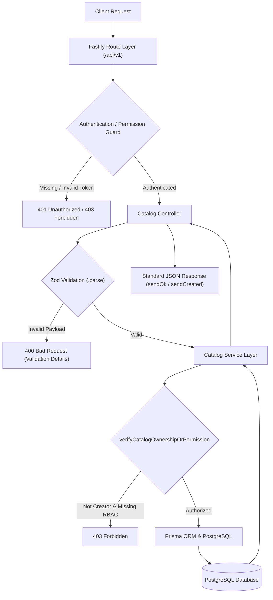

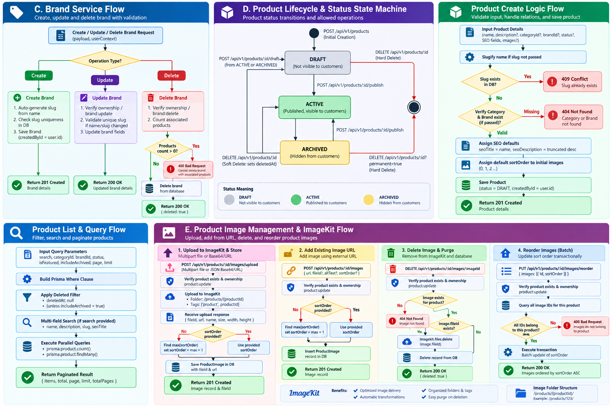

---

## 2. Authorization & Creator Ownership Decision Flow

The catalog system supports a dual authorization model where **Resource Creators** can manage their own resources, and **Admins with RBAC permissions** can manage any resource.

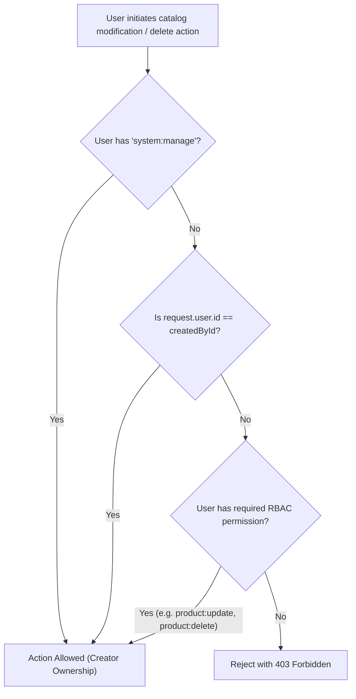

---

## 3. Data Models & Entity Relationships

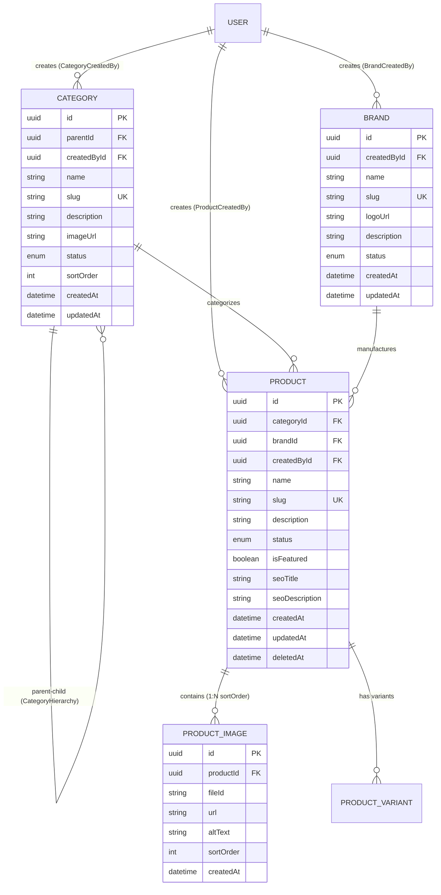

---

## 4. Service Workflows & Business Logic

### A. Category Service Flow & Cycle Detection

The Category Service prevents circular references (e.g., setting a sub-child as the parent of an ancestor) and safeguards against deleting categories with active products.

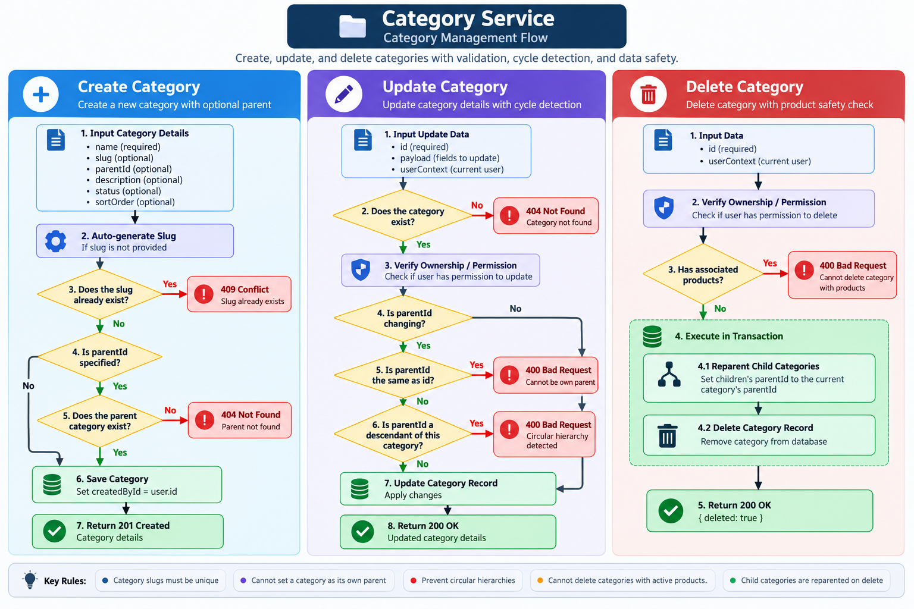

```mermaid
flowchart TD
    subgraph CreateCategory ["Create Category Flow"]
        C1["Input: name, slug?, parentId?, description?, status?, sortOrder?"] --> C2["Auto-generate slug if omitted"]
        C2 --> C3{"Slug exists?"}
        C3 -- "Yes" --> C_ErrSlug["409 Conflict: Slug already exists"]
        C3 -- "No" --> C4{"parentId specified?"}
        C4 -- "Yes" --> C5{"Parent exists in DB?"}
        C5 -- "No" --> C_ErrParent["404 Not Found: Parent not found"]
        C5 -- "Yes" --> C6["Save Category (createdById = user.id)"]
        C4 -- "No" --> C6
        C6 --> C_Done["Return 201 Created Category"]
    end

    subgraph UpdateCategory ["Update Category Flow & Cycle Check"]
        U1["Input: id, payload, userContext"] --> U2{"Category exists?"}
        U2 -- "No" --> U_Err404["404 Not Found"]
        U2 -- "Yes" --> U3["Verify Ownership / permission"]
        U3 --> U4{"parentId changing?"}
        U4 -- "No" --> U7["Apply Updates"]
        U4 -- "Yes" --> U5{"parentId == id?"}
        U5 -- "Yes" --> U_ErrSelf["400 Bad Request: Cannot be own parent"]
        U5 -- "No" --> U6{"isDescendantOf(parentId, id)?"}
        U6 -- "Yes (Cycle)" --> U_ErrCycle["400 Bad Request: Circular hierarchy detected"]
        U6 -- "No" --> U7["Update Category Record"]
        U7 --> U_Done["Return 200 OK"]
    end

    subgraph DeleteCategory ["Delete Category & Child Reparenting"]
        D1["Input: id, userContext"] --> D2["Verify Ownership / permission"]
        D2 --> D3{"Has associated products?"}
        D3 -- "Yes (count > 0)" --> D_ErrProducts["400 Bad Request: Cannot delete category with products"]
        D3 -- "No" --> D4["In Transaction: Reparent child categories to parentId"]
        D4 --> D5["Delete category record"]
        D5 --> D_Done["Return 200 OK (deleted: true)"]
    end
```

---

### B. Category Tree Hierarchical Structure

The `GET /api/v1/categories/tree` endpoint recursively constructs a tree from root categories (where `parentId = null`) down to all nested subcategories.

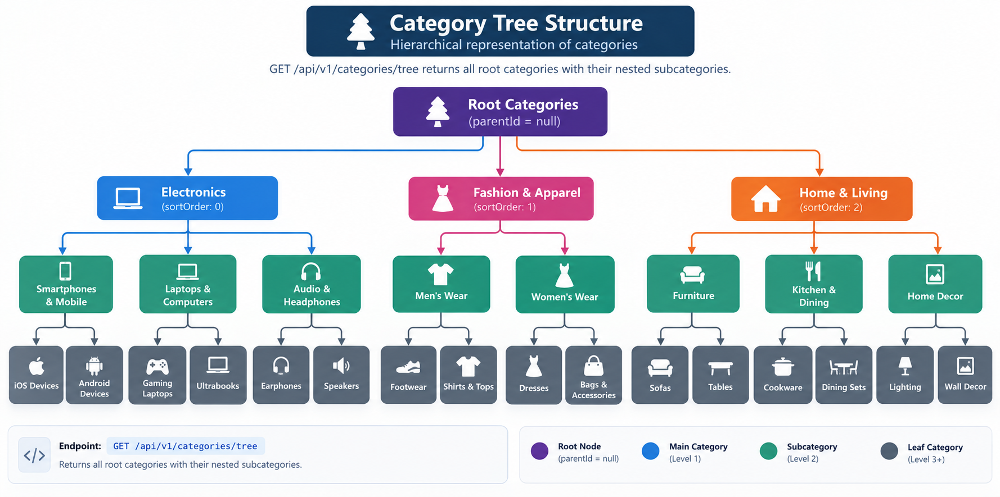

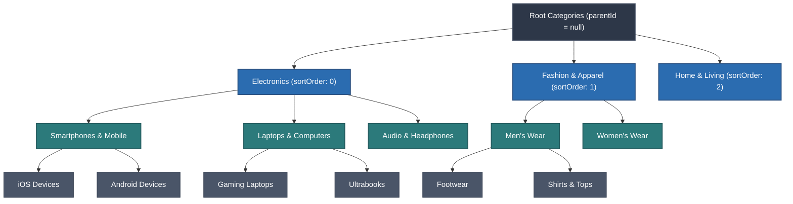

---

### C. Brand Service Flow

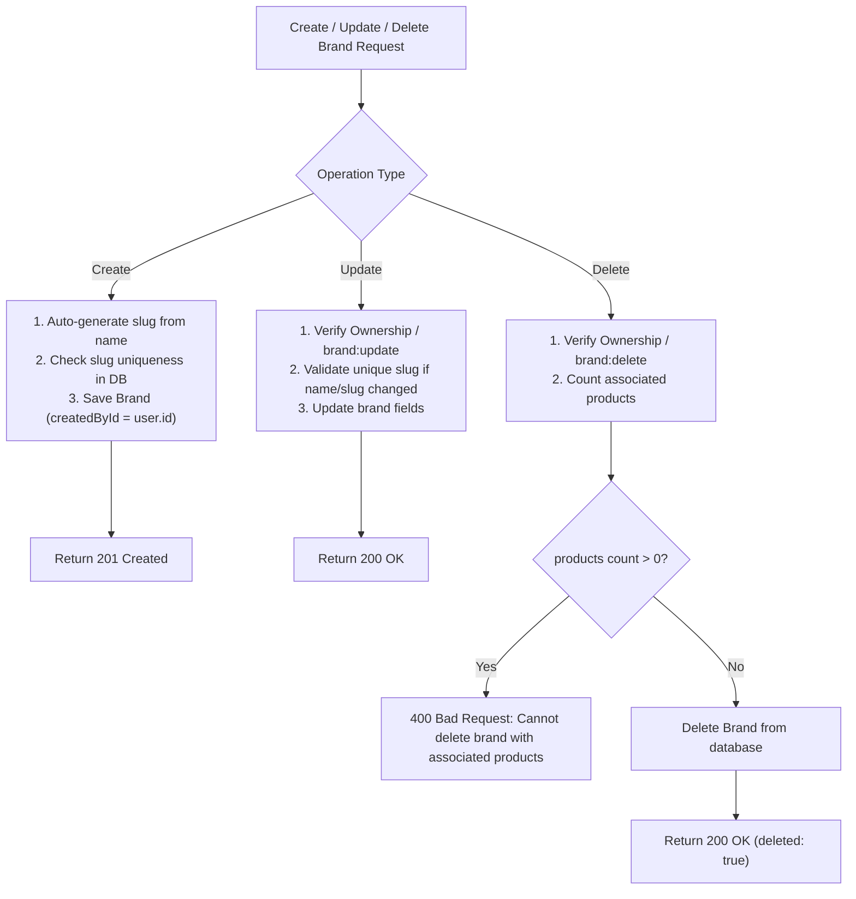

---

### D. Product Lifecycle & Status State Machine

Products start in `DRAFT` status and progress through `ACTIVE` (Published), `ARCHIVED`, or deletion.

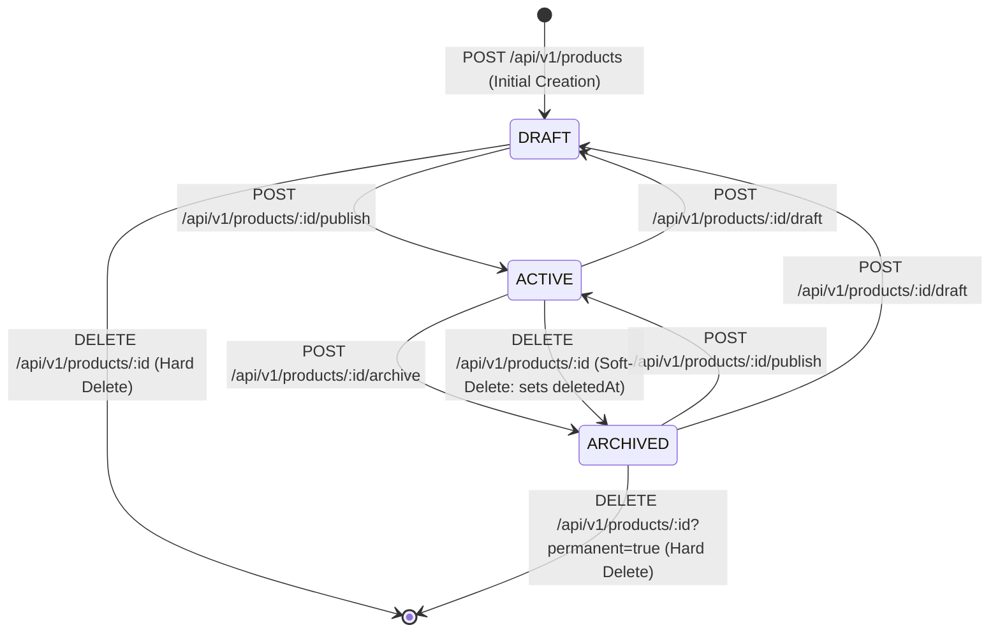

#### Product Create & Query Logic Flow:

```mermaid
flowchart TD
    subgraph ProductCreate ["Create Product Logic"]
        P1["Input: name, description?, categoryId?, brandId?, status?, SEO fields, images?"] --> P2["Slugify name if slug not passed"]
        P2 --> P3{"Slug exists?"}
        P3 -- "Yes" --> P_ErrSlug["409 Conflict: Slug already exists"]
        P3 -- "No" --> P4{"Verify Category & Brand exist if passed"}
        P4 -- "Missing" --> P_ErrFK["404 Not Found (Category / Brand)"]
        P4 -- "Valid" --> P5["Assign SEO defaults: seoTitle = name, seoDescription = truncated desc"]
        P5 --> P6["Assign default sortOrder (0, 1, 2...) to initial images"]
        P6 --> P7["Save Product (status = DRAFT, createdById = user.id)"]
        P7 --> P_Done["Return 201 Created"]
    end

    subgraph ProductQuery ["Product List & Filter Engine"]
        Q1["Input: search, categoryId, brandId, status, isFeatured, includeArchived, pagination"] --> Q2["Build Prisma Where Clause"]
        Q2 --> Q3["deletedAt: null (unless includeArchived = true)"]
        Q3 --> Q4["Multi-field search across (name, description, slug, seoTitle)"]
        Q4 --> Q5["Execute parallel: prisma.product.count & prisma.product.findMany"]
        Q5 --> Q6["Return { items, total, page, limit, totalPages }"]
    end
```

---

### E. Product Image Management & ImageKit Flow

Images can be uploaded directly via binary multipart stream or base64/URL payload to ImageKit (`@imagekit/nodejs`), tagged, organized into `/products/{productId}` folders, and automatically purged on deletion.

```mermaid
flowchart TD
    subgraph ImageKitUpload ["Upload to ImageKit & Store Flow"]
        UI1["POST /api/v1/products/:id/images/upload\n(Multipart file or JSON Base64/URL)"] --> UI2["Verify product exists & Ownership / product:update"]
        UI2 --> UI3["Upload to ImageKit:\n- Folder: /products/{productId}\n- Tags: ['product', productId]"]
        UI3 --> UI4["Receive upload response from ImageKit:\n{ fileId, url, name, size, width, height }"]
        UI4 --> UI5{"sortOrder provided?"}
        UI5 -- "No" --> UI6["Find max(sortOrder) on existing images -> set sortOrder = max + 1"]
        UI5 -- "Yes" --> UI7["Use provided sortOrder"]
        UI6 --> UI8["Save ProductImage in DB with fileId & url"]
        UI7 --> UI8
        UI8 --> UI_Done["Return 201 Created with Image record & fileId"]
    end

    subgraph AddImageURL ["Add Existing URL Flow"]
        AI1["POST /api/v1/products/:id/images { url, fileId?, altText?, sortOrder? }"] --> AI2["Verify product exists & Ownership / product:update"]
        AI2 --> AI3{"sortOrder provided?"}
        AI3 -- "No" --> AI4["Find max(sortOrder) -> set sortOrder = max + 1"]
        AI3 -- "Yes" --> AI5["Use provided sortOrder"]
        AI4 --> AI6["Insert ProductImage record in DB"]
        AI5 --> AI6
        AI6 --> AI_Done["Return 201 Created"]
    end

    subgraph DeleteImage ["Delete Image & Purge Flow"]
        DI1["DELETE /api/v1/products/:id/images/:imageId"] --> DI2["Verify product exists & Ownership / product:update"]
        DI2 --> DI3{"Image exists for product?"}
        DI3 -- "No" --> DI_Err["404 Not Found"]
        DI3 -- "Yes" --> DI4{"image.fileId exists?"}
        DI4 -- "Yes" --> DI5["imagekit.files.delete(image.fileId)"]
        DI4 -- "No" --> DI6["Delete record from DB"]
        DI5 --> DI6
        DI6 --> DI_Done["Return 200 OK (deleted: true)"]
    end

    subgraph ReorderImages ["Transactional Batch Reorder Flow"]
        RI1["PUT /api/v1/products/:id/images/reorder { images: [{ id, sortOrder }] }"] --> RI2["Verify product exists & Ownership / product:update"]
        RI2 --> RI3["Query all image IDs for this product"]
        RI3 --> RI4{"All IDs belong to this product?"}
        RI4 -- "No" --> RI_Err["400 Bad Request: Images do not belong to product"]
        RI4 -- "Yes" --> RI5["prisma.$transaction: Execute batch update of sortOrder"]
        RI5 --> RI6["Return 200 OK with images ordered by sortOrder ASC"]
    end
```

---

## 5. API Reference

All routes are mounted under `/api/v1`. In Swagger UI (`/docs`), endpoints are organized into clean collapsible tabs.

### Categories (`/api/v1/categories`) — Tab: `Catalog - Categories`

| Method | Path | Auth / Permission | Description |
|---|---|---|---|
| `GET` | `/categories` | Public | List categories (pagination, search, parent filter) |
| `GET` | `/categories/tree` | Public | Get hierarchical nested category tree |
| `GET` | `/categories/:id` | Public | Get category by UUID |
| `GET` | `/categories/slug/:slug` | Public | Get category by slug |
| `POST` | `/categories` | `category:create` or `product:create` | Create a category |
| `PATCH` | `/categories/:id` | Creator OR `category:update` | Update category details / parent |
| `DELETE` | `/categories/:id` | Creator OR `category:delete` | Delete category |

#### Example Category Create Request:
```http
POST /api/v1/categories
Authorization: Bearer <access-token>
Content-Type: application/json

{
  "name": "Smartphones",
  "parentId": "parent-category-uuid",
  "description": "Smartphones and cellular devices",
  "imageUrl": "https://example.com/smartphones.jpg",
  "status": "ACTIVE",
  "sortOrder": 1
}
```

---

### Brands (`/api/v1/brands`) — Tab: `Catalog - Brands`

| Method | Path | Auth / Permission | Description |
|---|---|---|---|
| `GET` | `/brands` | Public | List brands (pagination, search, status) |
| `GET` | `/brands/:id` | Public | Get brand by UUID |
| `GET` | `/brands/slug/:slug` | Public | Get brand by slug |
| `POST` | `/brands` | `brand:create` or `product:create` | Create a new brand |
| `PATCH` | `/brands/:id` | Creator OR `brand:update` | Update brand details |
| `DELETE` | `/brands/:id` | Creator OR `brand:delete` | Delete brand |

#### Example Brand Create Request:
```http
POST /api/v1/brands
Authorization: Bearer <access-token>
Content-Type: application/json

{
  "name": "Sony",
  "logoUrl": "https://example.com/sony.png",
  "description": "Sony Electronics",
  "status": "ACTIVE"
}
```

---

### Products & Lifecycle (`/api/v1/products`) — Tab: `Catalog - Products`

| Method | Path | Auth / Permission | Description |
|---|---|---|---|
| `GET` | `/products` | Public | List products (with search & filters) |
| `GET` | `/products/:id` | Public | Get product by UUID |
| `GET` | `/products/slug/:slug` | Public | Get product by slug |
| `POST` | `/products` | `product:create` | Create product (default `DRAFT`) |
| `PATCH` | `/products/:id` | Creator OR `product:update` | Update product info & SEO fields |
| `POST` | `/products/:id/publish` | Creator OR `product:update` | Publish product (`ACTIVE`) |
| `POST` | `/products/:id/draft` | Creator OR `product:update` | Move product to `DRAFT` |
| `POST` | `/products/:id/archive` | Creator OR `product:update` | Archive product (`ARCHIVED`) |
| `DELETE` | `/products/:id` | Creator OR `product:delete` | Soft-delete / Delete product |

#### Example Product Create Request:
```http
POST /api/v1/products
Authorization: Bearer <access-token>
Content-Type: application/json

{
  "name": "Sony WH-1000XM5",
  "description": "Wireless Noise Canceling Headphones",
  "categoryId": "category-uuid",
  "brandId": "brand-uuid",
  "isFeatured": true,
  "seoTitle": "Buy Sony WH-1000XM5 Headphones",
  "seoDescription": "Premium noise canceling wireless headphones with 30hr battery.",
  "images": [
    {
      "url": "https://example.com/headphones-main.jpg",
      "altText": "Front view",
      "sortOrder": 0
    }
  ]
}
```

---

### Product Images & ImageKit (`/api/v1/products/:id/images`) — Tab: `Catalog - Images`

| Method | Path | Auth / Permission | Description |
|---|---|---|---|
| `GET` | `/products/images/auth` | Authenticated | Generate signed ImageKit client-side auth tokens (`token`, `expire`, `signature`, `publicKey`) |
| `POST` | `/products/:id/images/upload` | Creator OR `product:update` | Upload image to ImageKit via **multipart/form-data** (`file`, `altText`, `sortOrder`) or **JSON** (`file` as base64/URL) |
| `POST` | `/products/:id/images` | Creator OR `product:update` | Add image record by existing URL & optional `fileId` |
| `DELETE` | `/products/:id/images/:imageId` | Creator OR `product:update` | Delete product image from database and purge from ImageKit storage |
| `PUT` | `/products/:id/images/reorder` | Creator OR `product:update` | Transactionally batch reorder product images |

#### Example 1: Multipart File Upload (`POST /api/v1/products/:id/images/upload`)
```http
POST /api/v1/products/product-uuid/images/upload
Authorization: Bearer <access-token>
Content-Type: multipart/form-data; boundary=----WebKitFormBoundary

------WebKitFormBoundary
Content-Disposition: form-data; name="file"; filename="headphones-side.jpg"
Content-Type: image/jpeg

<binary file content>
------WebKitFormBoundary
Content-Disposition: form-data; name="altText"

Side angle view of wireless headphones
------WebKitFormBoundary
Content-Disposition: form-data; name="sortOrder"

1
------WebKitFormBoundary--
```

#### Example 2: Base64 / Remote URL Upload (`POST /api/v1/products/:id/images/upload`)
```http
POST /api/v1/products/product-uuid/images/upload
Authorization: Bearer <access-token>
Content-Type: application/json

{
  "file": "data:image/png;base64,iVBORw0KGgoAAAANSUhEUgAAAAEAAAABCAYAAAAfFcSJAAAADUlEQVR42mNk+M9QDwADhgGAWjR9awAAAABJRU5ErkJggg==",
  "fileName": "headphones-custom.png",
  "altText": "Custom angle view",
  "sortOrder": 2
}
```

#### Example 3: Client-Side Upload Auth Generation (`GET /api/v1/products/images/auth`)
```http
GET /api/v1/products/images/auth
Authorization: Bearer <access-token>

Response 200 OK:
{
  "success": true,
  "data": {
    "token": "d7b32d66-a36c-48be-a6b1-0f493ff43bf1",
    "expire": 1757134200,
    "signature": "31b40ca0ddf4ba5121b64e5657ef78f0d8692795",
    "publicKey": "public_...",
    "urlEndpoint": "https://ik.imagekit.io/your_id"
  }
}
```

#### Example 4: Image Reorder Request (`PUT /api/v1/products/:id/images/reorder`)
```http
PUT /api/v1/products/product-uuid/images/reorder
Authorization: Bearer <access-token>
Content-Type: application/json

{
  "images": [
    { "id": "image-uuid-1", "sortOrder": 0 },
    { "id": "image-uuid-2", "sortOrder": 1 },
    { "id": "image-uuid-3", "sortOrder": 2 }
  ]
}
```

---

## 6. Testing & Development Workflows

### Run Automated Tests
```powershell
# Run the complete test suite
npm test -- --run

# Run only catalog tests
npx vitest run src/__tests__/catalog.unit.test.ts
npx vitest run src/__tests__/catalog.integration.test.ts
```

### TypeScript Validation
```powershell
npm run typecheck
```

### Production Build
```powershell
npm run build
```

### Interactive API Documentation (Swagger)
Start the development server:
```powershell
npm run dev
```
Open **`http://localhost:5000/docs`** in your browser. All catalog endpoints are grouped into clean, searchable tabs:
- **`Catalog - Categories`**
- **`Catalog - Brands`**
- **`Catalog - Products`**
- **`Catalog - Images`**
