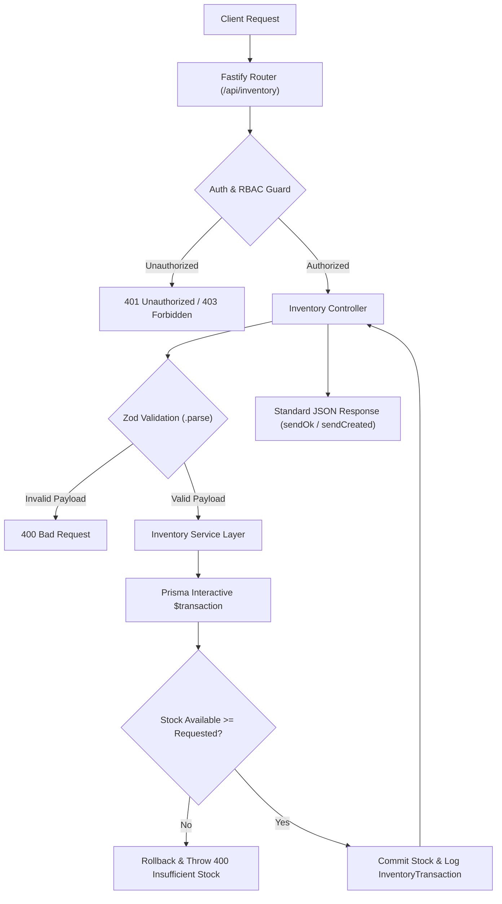
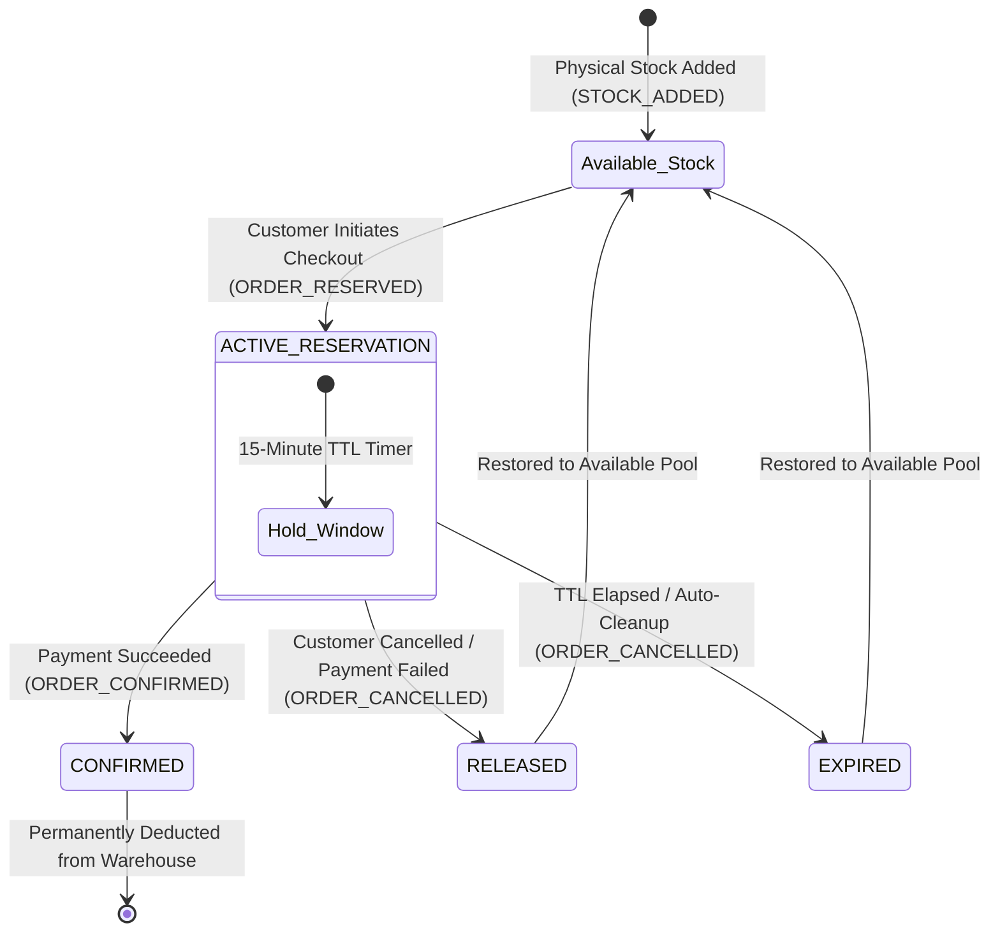

# Inventory Management Developer Guide

This document provides a comprehensive technical guide for developers working with the **Inventory Management System** in this backend. It details the architecture, stock operations, immutable transaction audit logs, reservation lifecycles, overselling prevention, and checkout payment simulation workflows.

---

## 1. Overview & Architecture

The Inventory module is located under `src/modules/inventory/` and follows a strict layered architecture:

```text
src/modules/inventory/
├── validations/
│   └── inventory.validation.ts          # Zod validation schemas for stock, reservations, and simulations
├── services/
│   ├── stock.service.ts                 # Stock levels, additions, removals, and adjustments
│   ├── reservation.service.ts           # Concurrency-safe reservations, confirm/release, and TTL sweeps
│   ├── transaction.service.ts           # Immutable transaction audit logs
│   ├── checkoutSimulation.service.ts    # End-to-end checkout & payment test flow simulation
│   └── inventory.service.ts             # Unified facade delegating to modular services
├── controller/
│   └── inventory.controller.ts          # Fastify HTTP request handlers with standard JSON response envelopes
└── routes/
    └── inventory.route.ts               # Route definitions under /api/inventory with RBAC permission guards
```

### High-Level Inventory Request Pipeline



---

## 2. Stock Reservation & Checkout Lifecycle

To guarantee **zero overselling** in high-concurrency e-commerce checkout environments, stock is temporarily reserved when a customer initiates checkout. If payment succeeds, the reservation is confirmed and stock committed; if payment fails or times out, the reservation is released and stock restored.

### Reservation State Flow



---

## 3. Database Models & Schema

### `Inventory` (Per-Variant Stock Table)
- **`id`** (`Uuid`): Unique inventory record ID.
- **`variantId`** (`Uuid`, Unique): Associated `ProductVariant`.
- **`availableQuantity`** (`Int`): Available purchasable stock.
- **`reservedQuantity`** (`Int`): Stock currently locked in active checkout sessions.
- **`reorderLevel`** (`Int?`): Threshold triggering low stock alerts.
- **`createdAt` / `updatedAt`**: Audit timestamps.

### `InventoryReservation` (Checkout Holds)
- **`id`** (`Uuid`): Reservation identifier.
- **`variantId`** (`Uuid`): Target product variant.
- **`orderId`** (`Uuid?`): Associated Order (if initialized).
- **`quantity`** (`Int`): Units held.
- **`status`** (`ACTIVE` | `CONFIRMED` | `RELEASED` | `EXPIRED`).
- **`expiresAt`** (`DateTime`): Expiration timestamp (default: `now + 15 min`).

### `InventoryTransaction` (Immutable Audit Ledger)
Every shift in physical or reserved inventory creates an immutable ledger entry:
- **`type`**: `STOCK_ADDED`, `STOCK_REMOVED`, `ORDER_RESERVED`, `ORDER_CONFIRMED`, `ORDER_CANCELLED`, `RETURNED`, `MANUAL_ADJUSTMENT`.
- **`quantity`** (`Int`): Quantity changed.
- **`referenceType`** (`String?`): e.g. `RESERVATION`, `ORDER`, `RESTOCK`, `WRITE_OFF`.
- **`referenceId`** (`String?`): Foreign entity ID.
- **`note`** (`String?`): Audit explanation.

---

## 4. API Endpoints Reference

| Method | Endpoint | Access Level | Description |
|---|---|---|---|
| `GET` | `/api/inventory/variant/:variantId` | `[Admin: inventory:read]` | Get available, reserved, and total stock for a variant |
| `GET` | `/api/inventory` | `[Admin: inventory:read]` | List all inventory records with search & low-stock filter |
| `GET` | `/api/inventory/low-stock` | `[Admin: inventory:read]` | List variants currently at or below reorder threshold |
| `POST` | `/api/inventory/add-stock` | `[Admin: inventory:update]` | Add stock units & record `STOCK_ADDED` |
| `POST` | `/api/inventory/remove-stock` | `[Admin: inventory:update]` | Remove damaged/shrinkage stock & record `STOCK_REMOVED` |
| `POST` | `/api/inventory/adjust` | `[Admin: inventory:update]` | Manual stock synchronization & record `MANUAL_ADJUSTMENT` |
| `GET` | `/api/inventory/transactions` | `[Admin: inventory:read]` | Paginated immutable audit ledger |
| `POST` | `/api/inventory/reservations/reserve` | `[Authenticated User]` | Reserve stock with TTL for checkout session |
| `POST` | `/api/inventory/reservations/:id/confirm` | `[Admin: inventory:update]` | Confirm reservation upon payment capture |
| `POST` | `/api/inventory/reservations/:id/release` | `[Authenticated User]` | Release reservation upon payment failure/cancel |
| `POST` | `/api/inventory/reservations/cleanup-expired` | `[Admin: inventory:update]` | Auto-expire stale holds and restore available stock |
| `POST` | `/api/inventory/checkout/simulate` | `[Authenticated User]` | End-to-end checkout & payment test simulation |

---

## 5. Testing & Checkout Simulation

For developers and QA testing checkout flows prior to integrating real payment gateways:

### Simulation Request
```http
POST /api/inventory/checkout/simulate
Authorization: Bearer <JWT>
Content-Type: application/json

{
  "variantId": "09804e38-fc33-4f95-ba38-16cbaf9b4860",
  "quantity": 2,
  "simulatePaymentSuccess": true,
  "holdMinutes": 15
}
```

### Simulated Timeline Response
```json
{
  "success": true,
  "message": "Checkout simulation completed",
  "data": {
    "flowStatus": "ORDER_COMPLETED",
    "variantId": "09804e38-fc33-4f95-ba38-16cbaf9b4860",
    "quantity": 2,
    "timeline": [
      {
        "step": 1,
        "action": "STOCK_RESERVED",
        "status": "SUCCESS",
        "message": "Successfully reserved 2 units for checkout."
      },
      {
        "step": 2,
        "action": "SIMULATED_PAYMENT",
        "status": "SUCCESS",
        "message": "Payment simulation completed successfully."
      },
      {
        "step": 3,
        "action": "RESERVATION_CONFIRMED",
        "status": "COMPLETED",
        "message": "Reservation confirmed and stock successfully committed."
      }
    ]
  }
}
```
