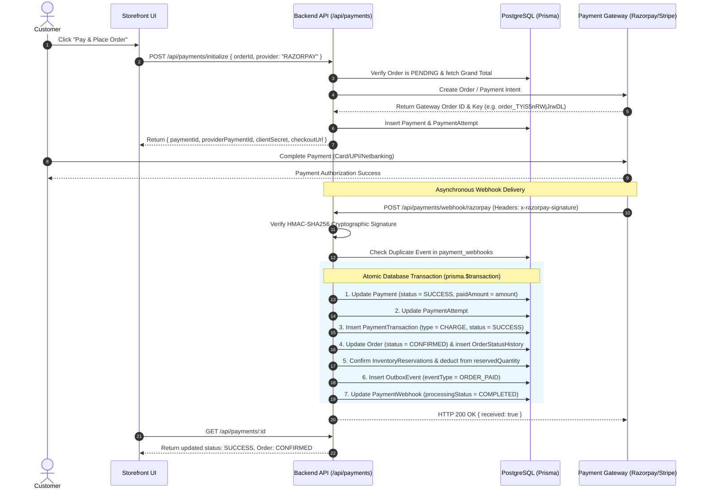

# 💳 Payment System Architecture & Integration Guide

Welcome to the comprehensive documentation for the **Payment Subsystem**. This document describes the end-to-end payment lifecycle, multi-provider gateway architecture, discrete attempt tracking, cryptographic webhook verification, transactional database fulfillment, outbox domain events, and full/partial refund processing.

---

## 🏛️ System Architecture

```text
                               ┌────────────────────────┐
                               │  Client / Frontend UI   │
                               └───────────┬────────────┘
                                           │
                        1. POST /api/payments/initialize
                                           │
                                           ▼
┌─────────────────────────────────────────────────────────────────────────────┐
│ Fastify API Layer (/api/payments)                                           │
│  ├─ Auth Guard: Validates Bearer Token & User Ownership                     │
│  ├─ Zod Validation: Validates Order UUID & Gateway Options                  │
│  └─ PaymentCreationService                                                  │
└──────────────────────┬──────────────────────────────────────────────────────┘
                       │
                       ▼
┌─────────────────────────────────────────────────────────────────────────────┐
│ Payment Provider Adapter Layer (IPaymentProvider)                           │
│  ├─ MockPaymentProvider: Local deterministic test sandbox                   │
│  ├─ RazorpayPaymentProvider: Live/Test Razorpay API (rzp_test_...)           │
│  └─ StripePaymentProvider: Stripe PaymentIntents & Webhooks                 │
└──────────────────────┬──────────────────────────────────────────────────────┘
                       │
                       ▼
┌─────────────────────────────────────────────────────────────────────────────┐
│ PostgreSQL Database Transaction                                             │
│  ├─ Payment (PENDING)                                                       │
│  ├─ PaymentAttempt #1 (PROCESSING)                                          │
│  └─ Order (PAYMENT_PENDING)                                                 │
└─────────────────────────────────────────────────────────────────────────────┘
```

---

## 🔄 End-to-End Payment & Webhook Lifecycle



---

## ⚡ Key Features & Capabilities

### 1. Multi-Provider Gateway Registry
The system defines a pluggable `IPaymentProvider` interface:
- **`MOCK`**: Local sandbox provider with timing-safe HMAC signature verification for offline development and CI/CD pipelines.
- **`RAZORPAY`**: Integrates with live or test Razorpay credentials (`RAZORPAY_TEST_API_KEY` & `RAZORPAY_TEST_SECRET_KEY`), generating real Razorpay orders in INR/paise.
- **`STRIPE`**: Supports Stripe PaymentIntents and `stripe-signature` verification.

### 2. Discrete Payment Attempts & Retries
Every discrete transaction attempt is tracked in `PaymentAttempt`:
- Monotonically incrementing attempt numbers (`attemptNumber: 1, 2, ...`).
- Detailed failure logging (`failureCode`, `failureMessage`, `completedAt`).
- Endpoint `POST /api/payments/retry` enables retrying failed payments without recreating the order.

### 3. Idempotent Webhook Processing
- Unique constraint `@@unique([provider, providerEventId])` on `PaymentWebhook` prevents double-charging or duplicate fulfillment side effects.
- If a webhook replay arrives, the system verifies signature and returns `200 OK` (`idempotent: true`) without re-running transactions.

### 4. Full & Partial Refunds
- Validates remaining refundable balance: $\text{Refundable} = \text{paidAmount} - \text{refundedAmount}$.
- Issues refund via provider gateway.
- Inside an atomic transaction:
  - Updates `refundedAmount`.
  - Sets payment status to `PARTIALLY_REFUNDED` or `REFUNDED`.
  - If fully refunded, updates order status to `REFUNDED`.
  - Inserts `PaymentTransaction` of type `REFUND`.
  - Emits `OutboxEvent` (`PAYMENT_REFUNDED` / `PAYMENT_PARTIALLY_REFUNDED`).

### 5. Payment Reconciliation
- Endpoint `POST /api/payments/reconcile` enables administrators to query the payment gateway directly, automatically healing delayed or missed webhook notifications.

---

## 📑 API Reference

| Method | Endpoint | Access Level | Description |
| :--- | :--- | :--- | :--- |
| `POST` | `/api/payments/initialize` | Authenticated / Public | Initialize payment session for a `PENDING` order |
| `POST` | `/api/payments/retry` | Authenticated / Public | Retry payment attempt for existing payment record |
| `GET` | `/api/payments/:id` | Authenticated / Public | Fetch complete payment details, attempts, and transactions |
| `POST` | `/api/payments/webhook/:provider` | Public / Gateway | Ingest and idempotently process asynchronous provider webhooks |
| `POST` | `/api/payments/refund` | Admin (`payment:refund`) | Process full or partial refunds with balance check |
| `POST` | `/api/payments/reconcile` | Admin (`payment:read`) | Reconcile payment state against external gateway |
| `GET` | `/api/payments/admin/list` | Admin (`payment:read`) | Paginated admin search across all payments |

---

## 🔑 Environment Variables Configuration

```env
# Razorpay Credentials (Test or Live)
RAZORPAY_TEST_API_KEY=rzp_test_TYiIpbrDck7mel
RAZORPAY_TEST_SECRET_KEY=6LD79gkfi77yz4l58aJu1Oz3
RAZORPAY_WEBHOOK_SECRET=your_razorpay_webhook_secret

# Stripe Credentials (Optional)
STRIPE_SECRET_KEY=sk_test_...
STRIPE_WEBHOOK_SECRET=whsec_...
```
