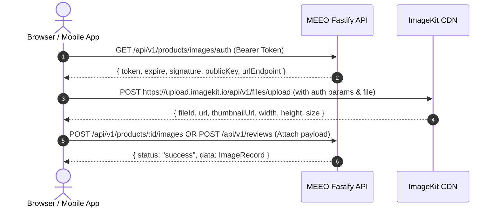

# MEEO Catalog & Reviews Media Architecture Guide
## Unified ImageKit Media System, Product Banners, Variant Images & Review Photos

This document details the unified, multi-entity `Image` architecture in the MEEO e-commerce backend, explaining all routes, request payloads, response formats, ImageKit direct-upload workflows, and storefront frontend implementation criteria.

---

## 1. Architecture Overview

### Unified Reusable `Image` Model
Instead of fragmented image tables across modules, MEEO uses a single, indexed `Image` table (`images`) backed by **ImageKit CDN**.

```prisma
model Image {
  id               String          @id @default(uuid()) @db.Uuid
  fileId           String?         // ImageKit file identifier for CDN management & purge
  url              String          // Full CDN delivery URL
  thumbnailUrl     String?         // Auto-generated thumbnail URL
  altText          String?         // Accessibility & SEO description
  sortOrder        Int             @default(0)
  width            Int?
  height           Int?
  size             Int?

  productId        String?         @db.Uuid
  productVariantId String?         @db.Uuid
  reviewId         String?         @db.Uuid

  product          Product?        @relation("ProductImages", fields: [productId], references: [id], onDelete: Cascade)
  productVariant   ProductVariant? @relation("VariantImages", fields: [productVariantId], references: [id], onDelete: Cascade)
  review           Review?         @relation("ReviewImages", fields: [reviewId], references: [id], onDelete: Cascade)
}
```

### Key Capabilities
1. **Product `bannerImage`**: Dedicated JSON asset on `Product` for campaign/hero banners (`{ fileId?, url, thumbnailUrl?, altText? }`).
2. **Product Gallery Images**: General product photos associated via `productId`.
3. **Variant-Specific Images**: SKU/color-specific photos associated via `productVariantId`.
4. **Customer Review Photos**: User-uploaded photos associated via `reviewId`.
5. **ImageKit CDN Lifecycle**: Automatic file purge from ImageKit when image records or parent entities are deleted.

---

## 2. API Routes Summary

### Product & Product Gallery
| Method | Endpoint | Access | Description |
|---|---|---|---|
| `GET` | `/api/v1/products` | Public | List products (includes gallery images and variants) |
| `GET` | `/api/v1/products/:id` | Public | Get product by UUID (includes banner, images, variants) |
| `GET` | `/api/v1/products/slug/:slug` | Public | Get product by slug |
| `POST` | `/api/v1/products` | `product:create` | Create product with optional `bannerImage` and initial `images` |
| `PATCH` | `/api/v1/products/:id` | Creator / `product:update` | Update product details, `bannerImage`, SEO |
| `GET` | `/api/v1/products/images/auth` | Authenticated | Get signed ImageKit client credentials for browser uploads |
| `POST` | `/api/v1/products/:id/images/upload` | Creator / `product:update` | Upload image binary (multipart) or base64 to ImageKit |
| `POST` | `/api/v1/products/:id/images` | Creator / `product:update` | Attach hosted image URL to product |
| `DELETE` | `/api/v1/products/:id/images/:imageId` | Creator / `product:update` | Delete product image (and purge from ImageKit) |
| `PUT` | `/api/v1/products/:id/images/reorder` | Creator / `product:update` | Reorder product gallery sequence |

### Product Variants & Variant Images
| Method | Endpoint | Access | Description |
|---|---|---|---|
| `POST` | `/api/v1/products/:productId/variants` | Creator / `product:update` | Create variant with optional initial `images` |
| `POST` | `/api/v1/products/:productId/variants/batch` | Creator / `product:update` | Batch create variants with pricing and images |
| `GET` | `/api/v1/products/:productId/variants` | Public | List variants for a product with images |
| `GET` | `/api/v1/variants/:id` | Public | Get variant by UUID with images & inventory |
| `GET` | `/api/v1/variants/sku/:sku` | Public | Get variant by SKU |
| `PATCH` | `/api/v1/variants/:id` | Creator / `product:update` | Update variant details and image array |
| `POST` | `/api/v1/variants/:id/images/upload` | Creator / `product:update` | Upload & attach variant-specific image |
| `POST` | `/api/v1/variants/:id/images` | Creator / `product:update` | Attach hosted image URL to variant |
| `DELETE` | `/api/v1/variants/:id/images/:imageId` | Creator / `product:update` | Delete variant image |
| `PUT` | `/api/v1/variants/:id/images/reorder` | Creator / `product:update` | Reorder variant image gallery |

### Reviews & Customer Photos
| Method | Endpoint | Access | Description |
|---|---|---|---|
| `POST` | `/api/v1/reviews` | Customer (Auth) | Submit review with rating and photo attachments |
| `PUT` | `/api/v1/reviews/:id` | Review Owner | Update review text, rating, and photos |
| `GET` | `/api/v1/reviews/products/:productId` | Public | Get approved reviews with attached photo gallery |
| `GET` | `/api/v1/reviews/my-reviews` | Customer (Auth) | Get customer's submitted reviews with photos |

---

## 3. Payloads & Response Examples

### A. Creating Product with `bannerImage` and Gallery Images
**`POST /api/v1/products`**

**Request Payload:**
```json
{
  "name": "Nike Air Max 90",
  "slug": "nike-air-max-90",
  "description": "Iconic waffle sole and visible Air cushioning.",
  "categoryId": "c0a80121-8b01-4b10-9b01-000000000001",
  "brandId": "b0a80121-8b01-4b10-9b01-000000000001",
  "status": "DRAFT",
  "isFeatured": true,
  "seoTitle": "Nike Air Max 90 - Classic Retro Sneakers",
  "seoDescription": "Shop the legendary Nike Air Max 90 with fast shipping.",
  "bannerImage": {
    "fileId": "ik_banner_airmax90",
    "url": "https://ik.imagekit.io/meeo/products/banners/airmax-hero.webp",
    "thumbnailUrl": "https://ik.imagekit.io/meeo/products/banners/airmax-hero.webp?tr=w-300",
    "altText": "Nike Air Max 90 Launch Banner"
  },
  "images": [
    {
      "fileId": "ik_prod_img_1",
      "url": "https://ik.imagekit.io/meeo/products/airmax90/front.webp",
      "thumbnailUrl": "https://ik.imagekit.io/meeo/products/airmax90/front.webp?tr=w-200",
      "altText": "Front view Nike Air Max 90",
      "sortOrder": 0
    },
    {
      "fileId": "ik_prod_img_2",
      "url": "https://ik.imagekit.io/meeo/products/airmax90/side.webp",
      "altText": "Side view",
      "sortOrder": 1
    }
  ]
}
```

**Success Response (`201 Created`):**
```json
{
  "status": "success",
  "message": "Product created successfully",
  "data": {
    "id": "7b82fcf3-329a-4c28-9a4f-cb6ec55e1c20",
    "name": "Nike Air Max 90",
    "slug": "nike-air-max-90",
    "status": "DRAFT",
    "isFeatured": true,
    "bannerImage": {
      "fileId": "ik_banner_airmax90",
      "url": "https://ik.imagekit.io/meeo/products/banners/airmax-hero.webp",
      "thumbnailUrl": "https://ik.imagekit.io/meeo/products/banners/airmax-hero.webp?tr=w-300",
      "altText": "Nike Air Max 90 Launch Banner"
    },
    "images": [
      {
        "id": "18f98a67-27b0-45c1-9252-a0e28d4fa910",
        "fileId": "ik_prod_img_1",
        "url": "https://ik.imagekit.io/meeo/products/airmax90/front.webp",
        "thumbnailUrl": "https://ik.imagekit.io/meeo/products/airmax90/front.webp?tr=w-200",
        "altText": "Front view Nike Air Max 90",
        "sortOrder": 0
      }
    ],
    "category": { "id": "...", "name": "Footwear", "slug": "footwear" },
    "brand": { "id": "...", "name": "Nike", "slug": "nike", "logoUrl": null }
  }
}
```

---

### B. Creating Variant with Variant-Specific Images
**`POST /api/v1/products/:productId/variants`**

**Request Payload:**
```json
{
  "sku": "AM90-RED-42",
  "barcode": "888407123456",
  "price": 149.99,
  "compareAtPrice": 179.99,
  "costPrice": 65.00,
  "status": "ACTIVE",
  "attributeValueIds": ["attr-val-color-red", "attr-val-size-42"],
  "initialStock": 50,
  "reorderLevel": 10,
  "images": [
    {
      "fileId": "ik_var_red_1",
      "url": "https://ik.imagekit.io/meeo/variants/am90-red-front.webp",
      "thumbnailUrl": "https://ik.imagekit.io/meeo/variants/am90-red-front.webp?tr=w-200",
      "altText": "Nike Air Max 90 Red Edition",
      "sortOrder": 0
    }
  ]
}
```

**Success Response (`201 Created`):**
```json
{
  "status": "success",
  "message": "Product variant created successfully",
  "data": {
    "id": "e89c1f6b-76b3-4f24-9b88-1123456789ab",
    "productId": "7b82fcf3-329a-4c28-9a4f-cb6ec55e1c20",
    "sku": "AM90-RED-42",
    "price": "149.99",
    "compareAtPrice": "179.99",
    "status": "ACTIVE",
    "images": [
      {
        "id": "45f98a67-27b0-45c1-9252-a0e28d4fa911",
        "fileId": "ik_var_red_1",
        "url": "https://ik.imagekit.io/meeo/variants/am90-red-front.webp",
        "thumbnailUrl": "https://ik.imagekit.io/meeo/variants/am90-red-front.webp?tr=w-200",
        "altText": "Nike Air Max 90 Red Edition",
        "sortOrder": 0
      }
    ],
    "inventory": {
      "availableQuantity": 50,
      "reservedQuantity": 0,
      "reorderLevel": 10
    }
  }
}
```

---

### C. Submitting Review with ImageKit Photo Attachments
**`POST /api/v1/reviews`**

**Request Payload:**
```json
{
  "productId": "7b82fcf3-329a-4c28-9a4f-cb6ec55e1c20",
  "rating": 5,
  "title": "Super comfortable and looks amazing!",
  "content": "These sneakers fit true to size. High quality materials.",
  "images": [
    {
      "fileId": "ik_rev_img_1",
      "url": "https://ik.imagekit.io/meeo/reviews/customer-photo-1.jpg",
      "thumbnailUrl": "https://ik.imagekit.io/meeo/reviews/customer-photo-1.jpg?tr=w-150",
      "altText": "Customer on-feet photo",
      "sortOrder": 0
    }
  ]
}
```

**Success Response (`201 Created`):**
```json
{
  "status": "success",
  "message": "Review submitted successfully. It is pending moderation before being publicly visible.",
  "data": {
    "id": "a90d8e7c-65b4-4a33-8f22-556677889900",
    "productId": "7b82fcf3-329a-4c28-9a4f-cb6ec55e1c20",
    "rating": 5,
    "title": "Super comfortable and looks amazing!",
    "content": "These sneakers fit true to size. High quality materials.",
    "isVerifiedPurchase": true,
    "status": "PENDING",
    "images": [
      {
        "id": "67f98a67-27b0-45c1-9252-a0e28d4fa912",
        "fileId": "ik_rev_img_1",
        "url": "https://ik.imagekit.io/meeo/reviews/customer-photo-1.jpg",
        "thumbnailUrl": "https://ik.imagekit.io/meeo/reviews/customer-photo-1.jpg?tr=w-150",
        "altText": "Customer on-feet photo",
        "sortOrder": 0
      }
    ]
  }
}
```

---

## 4. ImageKit Upload Workflows

### Method A: Direct Client-Side Browser Upload (Recommended)
This workflow offloads bandwidth from your server directly to ImageKit's globally distributed ingestion CDN.



#### Client Implementation Example (React / TypeScript):
```typescript
import ImageKit from "imagekit-javascript";

async function uploadProductPhoto(file: File, productId: string) {
  // 1. Get authentication parameters from MEEO server
  const authRes = await fetch("/api/v1/products/images/auth", {
    headers: { Authorization: `Bearer ${userToken}` }
  });
  const { data: auth } = await authRes.json();

  // 2. Initialize ImageKit SDK
  const ik = new ImageKit({
    publicKey: auth.publicKey,
    urlEndpoint: auth.urlEndpoint,
  });

  // 3. Perform direct client upload
  const uploadResult = await new Promise((resolve, reject) => {
    ik.upload(
      {
        file,
        fileName: `product-${productId}-${Date.now()}.${file.name.split('.').pop()}`,
        tags: ["product", productId],
        token: auth.token,
        signature: auth.signature,
        expire: auth.expire,
      },
      (err, result) => (err ? reject(err) : resolve(result))
    );
  });

  // 4. Attach image to Product or Variant
  const attachRes = await fetch(`/api/v1/products/${productId}/images`, {
    method: "POST",
    headers: {
      "Content-Type": "application/json",
      Authorization: `Bearer ${userToken}`
    },
    body: JSON.stringify({
      url: uploadResult.url,
      fileId: uploadResult.fileId,
      thumbnailUrl: uploadResult.thumbnailUrl,
      altText: file.name,
    })
  });

  return attachRes.json();
}
```

---

### Method B: Backend Server-Side Upload (Multipart or Base64)
If you prefer transmitting files through the server (e.g. from an Admin dashboard form or background worker):

**Endpoint:** `POST /api/v1/products/:id/images/upload` or `POST /api/v1/variants/:id/images/upload`

**Form-Data Headers:**
```http
POST /api/v1/products/7b82fcf3-329a-4c28-9a4f-cb6ec55e1c20/images/upload
Authorization: Bearer <ADMIN_TOKEN>
Content-Type: multipart/form-data; boundary=----WebKitFormBoundary

------WebKitFormBoundary
Content-Disposition: form-data; name="file"; filename="shoe.webp"
Content-Type: image/webp

<binary data>
------WebKitFormBoundary
Content-Disposition: form-data; name="altText"

Nike Air Max 90 Side View
------WebKitFormBoundary
Content-Disposition: form-data; name="sortOrder"

0
------WebKitFormBoundary--
```

---

## 5. Frontend Implementation Criteria

### 1. Product Detail Page (PDP) Dynamic Gallery Swapping
When a customer selects a variant option (e.g., Color = "Midnight Navy"):
- **Rule 1 (Variant Images Available)**: If the selected variant has items in `variant.images`, display the variant's gallery.
- **Rule 2 (Fallback to Parent)**: If `variant.images` is empty, gracefully fall back to `product.images`.
- **Thumbnail Strip**: Highlight the active image with an accessible ring (`aria-current="true"`), sync keyboard arrows (`Left`/`Right`), and smooth-scroll the active thumbnail into view.
- **Zoom & Magnification**: Provide a lens or modal zoom on desktop and pinch-to-zoom on touch devices.

### 2. Responsive Product Banner Rendering
Render `product.bannerImage` using semantic HTML `<picture>` with ImageKit's dynamic URL transformations for fast loading across viewport sizes:

```html
<picture>
  <!-- Desktop / Large Tablets -->
  <source
    media="(min-width: 1024px)"
    srcset="https://ik.imagekit.io/meeo/products/banners/airmax-hero.webp?tr=w-1440,ar-21-9,q-85 1x,
            https://ik.imagekit.io/meeo/products/banners/airmax-hero.webp?tr=w-2880,ar-21-9,q-80 2x"
  />
  <!-- Mobile Viewports -->
  <source
    media="(max-width: 1023px)"
    srcset="https://ik.imagekit.io/meeo/products/banners/airmax-hero.webp?tr=w-750,ar-16-9,q-85 1x,
            https://ik.imagekit.io/meeo/products/banners/airmax-hero.webp?tr=w-1500,ar-16-9,q-80 2x"
  />
  <!-- Fallback -->
  
</picture>
```

### 3. Review Photos & Media Grid
- **Photo Upload Widget**:
  - Accept up to 5 photos (`accept="image/png, image/jpeg, image/webp"`).
  - Client-side pre-validation for file sizes (< 5MB per photo).
  - Provide inline instant thumbnail previews with individual `Remove` buttons before submission.
- **Storefront Display**:
  - Show photo thumbnails under approved reviews.
  - Clicking any review photo opens a lightbox gallery showing full-size images with customer reviewer name and rating badge.

### 4. SEO & Performance Requirements
- All `` tags must include explicit `alt`, `width`, and `height` attributes to prevent Cumulative Layout Shift (CLS).
- Main above-the-fold hero image and first gallery image must use `loading="eager"` and `fetchpriority="high"`.
- Secondary gallery and review photos must use `loading="lazy"`.
- Serve WebP/AVIF automatically via ImageKit CDN format negotiation.
