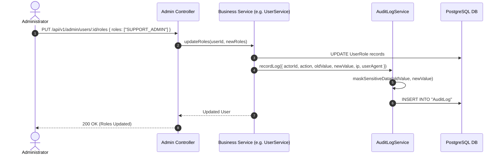

# Security & Compliance Audit Logs Module Documentation

> **Base Route**: `/api/v1/admin/audit-logs`  
> **Route Definition**: [`src/modules/audit/routes/auditLog.route.ts`](file:///e:/e-com/server/src/modules/audit/routes/auditLog.route.ts)  
> **Controller**: [`src/modules/audit/controller/auditLog.controller.ts`](file:///e:/e-com/server/src/modules/audit/controller/auditLog.controller.ts)  
> **Service**: [`src/modules/audit/services/auditLog.service.ts`](file:///e:/e-com/server/src/modules/audit/services/auditLog.service.ts)  
> **Validation Schemas**: [`src/modules/audit/validations/auditLog.validation.ts`](file:///e:/e-com/server/src/modules/audit/validations/auditLog.validation.ts)  
> **Admin Guide**: [`ADMIN_AUDIT.README.md`](file:///e:/e-com/server/src/modules/audit/ADMIN_AUDIT.README.md)

---

## Table of Contents

1. [Architecture & System Overview](#architecture--system-overview)
2. [Automatic Sensitive Data Masking](#automatic-sensitive-data-masking)
3. [Developer Integration Guide](#developer-integration-guide)
   - [How to Record an Audit Log from Any Service](#how-to-record-an-audit-log-from-any-service)
   - [Capturing Network Context in Controllers](#capturing-network-context-in-controllers)
4. [Endpoints Summary](#endpoints-summary)
5. [Endpoint Specifications & Scenarios](#endpoint-specifications--scenarios)
   - [1. Query System Audit Logs (`GET /`)](#1-query-system-audit-logs-get-)
   - [2. Get Audit Log Record Details (`GET /:id`)](#2-get-audit-log-record-details-get-id)
6. [Sequence Diagram](#sequence-diagram)
7. [Frontend React / Next.js Integration](#frontend-react--nextjs-integration)
8. [Error Handling & Security Principles](#error-handling--security-principles)

---

## Architecture & System Overview

The **Audit Logging** module records an immutable, append-only historical audit trail for administrative mutations, sensitive privilege changes, inventory restocks, order state updates, and refund operations.

### Key Architectural Principles

- **Append-Only Immutability**: Audit log records cannot be updated or deleted via the API.
- **Non-Blocking Resilience**: Audit log logging occurs asynchronously and safely catches errors so that a failure in logging never disrupts the primary business transaction.
- **Automatic PII Redaction**: Passwords, API tokens, card numbers, emails, and phone numbers are scrubbed prior to persistence.
- **Actor & Network Attribution**: Every record captures the actor user ID, client IP address, and browser User-Agent.

---

## Automatic Sensitive Data Masking

The engine uses [`maskSensitiveData()`](file:///e:/e-com/server/src/common/security/masking.ts) to recursively scrub objects before writing `oldValue` and `newValue`:

```json
{
  "email": "j***e@example.com",
  "password": "[REDACTED]",
  "cardNumber": "****-****-****-1234",
  "roles": ["CUSTOMER", "SUPPORT_ADMIN"]
}
```

---

## Developer Integration Guide

### How to Record an Audit Log from Any Service

```typescript
import { auditLogService } from "@/modules/audit/services/auditLog.service.js";

// Inside any service mutation method:
await auditLogService.recordLog({
  actorId: req.user?.id,
  action: "UPDATE_USER_ROLE",
  entityType: "User",
  entityId: targetUserId,
  oldValue: { roles: previousRoles },
  newValue: { roles: updatedRoles },
  ipAddress: req.ip,
  userAgent: req.headers["user-agent"] as string,
});
```

---

### Capturing Network Context in Controllers

In Fastify route handlers, extract IP and User-Agent from the incoming request object:

```typescript
const ipAddress = req.headers["x-forwarded-for"]?.toString() || req.ip;
const userAgent = req.headers["user-agent"] || "unknown";
```

---

## Endpoints Summary

| Method | Endpoint | Required Permission | Description |
|---|---|---|---|
| `GET` | `/api/v1/admin/audit-logs` | `audit:read` | Query system audit logs with actor, entity, and date filters |
| `GET` | `/api/v1/admin/audit-logs/:id` | `audit:read` | Inspect state diffs and context for a specific audit log record |

---

## Endpoint Specifications & Scenarios

---

### 1. Query System Audit Logs (`GET /`)

- **Method**: `GET`
- **URL**: `/api/v1/admin/audit-logs?entityType=User&page=1&limit=20`
- **Permission**: `audit:read` or `SUPER_ADMIN`

#### Response (`200 OK`)
```json
{
  "success": true,
  "status": "success",
  "data": {
    "items": [
      {
        "id": "audit-11111111-2222-3333-4444-555555555555",
        "action": "UPDATE_USER_ROLE",
        "entityType": "User",
        "entityId": "usr-22222222-3333-4444-5555-666666666666",
        "oldValue": { "roles": ["CUSTOMER"] },
        "newValue": { "roles": ["CUSTOMER", "SUPPORT_ADMIN"] },
        "ipAddress": "192.0.2.45",
        "userAgent": "Mozilla/5.0 (Macintosh; Intel Mac OS X 10_15_7)...",
        "createdAt": "2026-09-08T14:30:00.000Z",
        "actor": {
          "id": "usr-admin-1",
          "email": "superadmin@store.com",
          "name": "Sarah Connor"
        }
      }
    ],
    "pagination": {
      "page": 1,
      "limit": 20,
      "total": 1,
      "totalPages": 1
    }
  }
}
```

---

### 2. Get Audit Log Record Details (`GET /:id`)

- **Method**: `GET`
- **URL**: `/api/v1/admin/audit-logs/:id`
- **Permission**: `audit:read` or `SUPER_ADMIN`

---

## Sequence Diagram



---

## Frontend React / Next.js Integration

```tsx
import { useState, useEffect } from "react";

export function AuditLogsViewer() {
  const [logs, setLogs] = useState([]);
  const [selectedLog, setSelectedLog] = useState<any | null>(null);

  useEffect(() => {
    fetch("/api/v1/admin/audit-logs?limit=20")
      .then((res) => res.json())
      .then((json) => setLogs(json.data.items));
  }, []);

  return (
    <div>
      <h2>Security & Compliance Audit Trail</h2>
      <table>
        <thead>
          <tr>
            <th>Timestamp</th>
            <th>Action</th>
            <th>Entity</th>
            <th>Actor</th>
            <th>IP Address</th>
            <th>Actions</th>
          </tr>
        </thead>
        <tbody>
          {logs.map((log: any) => (
            <tr key={log.id}>
              <td>{new Date(log.createdAt).toLocaleString()}</td>
              <td><span className="badge">{log.action}</span></td>
              <td>{log.entityType} ({log.entityId?.slice(0, 8)})</td>
              <td>{log.actor?.email || "System"}</td>
              <td>{log.ipAddress || "-"}</td>
              <td>
                <button onClick={() => setSelectedLog(log)}>Inspect Diff</button>
              </td>
            </tr>
          ))}
        </tbody>
      </table>

      {selectedLog && (
        <div className="diff-modal">
          <h3>State Diff: {selectedLog.action}</h3>
          <pre>Previous: {JSON.stringify(selectedLog.oldValue, null, 2)}</pre>
          <pre>New: {JSON.stringify(selectedLog.newValue, null, 2)}</pre>
          <button onClick={() => setSelectedLog(null)}>Close</button>
        </div>
      )}
    </div>
  );
}
```

---

## Error Handling & Security Principles

| HTTP Status | Reason | Action |
|---|---|---|
| `400 Bad Request` | Invalid UUID param | Ensure UUID is properly formatted |
| `401 Unauthorized` | Missing token | Provide valid Bearer token |
| `403 Forbidden` | Missing `audit:read` permission | Account must be granted `audit:read` capability or `SUPER_ADMIN` role |
| `404 Not Found` | Record not found | Verify audit log ID exists |
