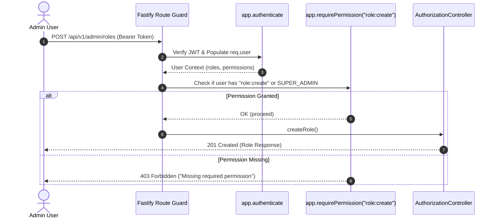
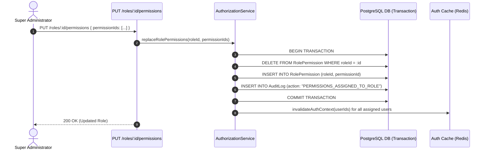

# Role-Based Access Control (RBAC) & Authorization Module Documentation

> **Base Route**: `/api/v1/admin`  
> **Route Definition**: [`src/modules/authorization/authorization.route.ts`](file:///e:/e-com/server/src/modules/authorization/authorization.route.ts)  
> **Controller**: [`src/modules/authorization/authorization.controller.ts`](file:///e:/e-com/server/src/modules/authorization/authorization.controller.ts)  
> **Service**: [`src/modules/authorization/authorization.service.ts`](file:///e:/e-com/server/src/modules/authorization/authorization.service.ts)  
> **Permissions Catalog**: [`src/modules/authorization/permission.constants.ts`](file:///e:/e-com/server/src/modules/authorization/permission.constants.ts)  
> **Permission Middleware**: [`src/modules/authorization/permission.middleware.ts`](file:///e:/e-com/server/src/modules/authorization/permission.middleware.ts)  
> **Admin Operations Guide**: [`ADMIN_AUTHORIZATION.README.md`](file:///e:/e-com/server/src/modules/authorization/ADMIN_AUTHORIZATION.README.md)

---

## Table of Contents

1. [Architecture & Design Principles](#architecture--design-principles)
2. [Granular Permission Guard Middleware](#granular-permission-guard-middleware)
3. [Developer Guide: Protecting New API Routes](#developer-guide-protecting-new-api-routes)
4. [Developer Guide: Adding New Permission Constants](#developer-guide-adding-new-permission-constants)
5. [Endpoints Summary](#endpoints-summary)
6. [Sequence Diagrams](#sequence-diagrams)
   - [1. Route Authorization Check Lifecycle](#1-route-authorization-check-lifecycle)
   - [2. Atomic Role Permission Update & Cache Invalidation](#2-atomic-role-permission-update--cache-invalidation)
7. [Frontend React / Next.js Role Management Component](#frontend-react--nextjs-role-management-component)
8. [Error Handling & Diagnostic Codes](#error-handling--diagnostic-codes)

---

## Architecture & Design Principles

The backend implements a **Capability-Based RBAC Model**:
- Routes declare the **minimum required permission** needed for execution (e.g. `order:update`, `payment:refund`).
- Users are assigned one or more **Roles** (`SUPER_ADMIN`, `SUPPORT_LEAD`, `FINANCE_MANAGER`, `CATALOG_EDITOR`).
- Roles encapsulate sets of **Permissions**.
- Users inheriting the required permission (or possessing the `SUPER_ADMIN` role) are authorized.

---

## Granular Permission Guard Middleware

The permission middleware [`permission.middleware.ts`](file:///e:/e-com/server/src/modules/authorization/permission.middleware.ts) verifies that the authenticated user possesses the requested permission:

```typescript
import { PERMISSIONS } from "@/modules/authorization/permission.constants.js";

// Guarding a Fastify route:
app.post(
  "/refund",
  {
    preHandler: [
      app.authenticate,
      app.requirePermission(PERMISSIONS.PAYMENT_REFUND),
    ],
  },
  paymentController.processRefund.bind(paymentController),
);
```

---

## Developer Guide: Protecting New API Routes

1. Import `PERMISSIONS` from `@/modules/authorization/permission.constants.js`.
2. Add `app.requirePermission(PERMISSIONS.<KEY>)` to the route's `preHandler` array.
3. Ensure `app.authenticate` is invoked prior to the permission guard.

```typescript
app.delete("/products/:id", {
  preHandler: [app.authenticate, app.requirePermission(PERMISSIONS.PRODUCT_DELETE)],
  handler: catalogController.deleteProduct.bind(catalogController),
});
```

---

## Developer Guide: Adding New Permission Constants

1. Add the new permission string in [`permission.constants.ts`](file:///e:/e-com/server/src/modules/authorization/permission.constants.ts):
```typescript
export const PERMISSIONS = {
  // ... existing permissions
  WAREHOUSE_DISPATCH: "warehouse:dispatch",
} as const;
```
2. Seed or create the permission in PostgreSQL using `prisma.permission.create({ data: { name: "warehouse:dispatch" } })`.

---

## Endpoints Summary

| Method | Endpoint | Required Permission | Description |
|---|---|---|---|
| `POST` | `/api/v1/admin/roles` | `role:create` | Create a new role |
| `GET` | `/api/v1/admin/roles` | `role:read` | List all system roles and permissions |
| `GET` | `/api/v1/admin/roles/:roleId` | `role:read` | Get specific role details |
| `PATCH`| `/api/v1/admin/roles/:roleId` | `role:update` | Update role name/description |
| `DELETE`| `/api/v1/admin/roles/:roleId` | `role:delete` | Delete custom role |
| `GET` | `/api/v1/admin/permissions` | `role:read` | List all available permissions |
| `PUT` | `/api/v1/admin/roles/:roleId/permissions` | `role:update` | Replace permissions for a role |
| `PUT` | `/api/v1/admin/users/:userId/roles` | `user:update` | Replace roles for a user |
| `GET` | `/api/v1/admin/users/:userId/sessions` | `user:read` | List active sessions for a user |
| `DELETE`| `/api/v1/admin/users/:userId/sessions/:sessionId` | `user:update` | Revoke a user login session |

---

## Sequence Diagrams

### 1. Route Authorization Check Lifecycle



### 2. Atomic Role Permission Update & Cache Invalidation



---

## Frontend React / Next.js Role Management Component

```tsx
import { useState, useEffect } from "react";

export function RoleManager() {
  const [roles, setRoles] = useState([]);
  const [permissions, setPermissions] = useState([]);

  useEffect(() => {
    // 1. Fetch roles & all permissions
    Promise.all([
      fetch("/api/v1/admin/roles").then((r) => r.json()),
      fetch("/api/v1/admin/permissions").then((r) => r.json()),
    ]).then(([rolesData, permsData]) => {
      setRoles(rolesData.data);
      setPermissions(permsData.data);
    });
  }, []);

  const assignPermissions = async (roleId: string, permissionIds: string[]) => {
    await fetch(`/api/v1/admin/roles/${roleId}/permissions`, {
      method: "PUT",
      headers: { "Content-Type": "application/json" },
      body: JSON.stringify({ permissionIds }),
    });
    alert("Permissions updated and cache flushed!");
  };

  return (
    <div>
      <h2>RBAC Role Management</h2>
      {roles.map((role: any) => (
        <div key={role.id} className="role-card">
          <h3>{role.name}</h3>
          <p>{role.description}</p>
          <p>Active Permissions: {role.permissions.map((p: any) => p.permission.name).join(", ")}</p>
        </div>
      ))}
    </div>
  );
}
```

---

## Error Handling & Diagnostic Codes

| HTTP Status | Error Reason | Explanation |
|---|---|---|
| `400 Bad Request` | `VALIDATION_ERROR` | Request body failed schema validation |
| `401 Unauthorized` | `UNAUTHENTICATED` | Missing or invalid bearer token |
| `403 Forbidden` | `FORBIDDEN` | Missing required granular permission |
| `404 Not Found` | `NOT_FOUND` | Role or permission UUID does not exist |
| `409 Conflict` | `PROTECTED_ROLE` | The `SUPER_ADMIN` role cannot be modified or deleted |
