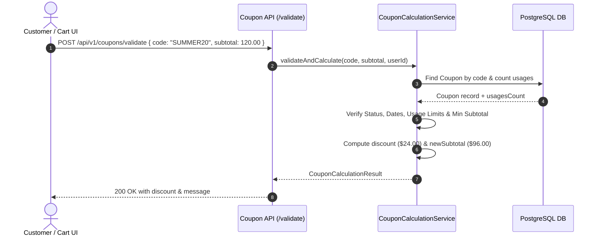
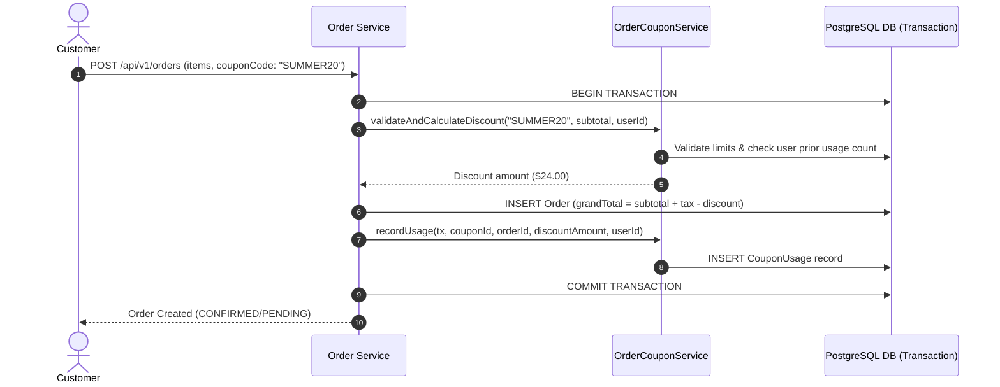

# Coupons & Promotions Module API Documentation

> **Base Route**: `/api/v1/coupons`  
> **Route Definition**: [`src/modules/coupons/routes/coupon.route.ts`](file:///e:/e-com/server/src/modules/coupons/routes/coupon.route.ts)  
> **Controller**: [`src/modules/coupons/controller/coupon.controller.ts`](file:///e:/e-com/server/src/modules/coupons/controller/coupon.controller.ts)  
> **Services**: [`src/modules/coupons/services/`](file:///e:/e-com/server/src/modules/coupons/services/)  
> **Validation Schemas**: [`src/modules/coupons/validations/coupon.validation.ts`](file:///e:/e-com/server/src/modules/coupons/validations/coupon.validation.ts)  
> **Admin Guide**: [`ADMIN_COUPONS.README.md`](file:///e:/e-com/server/src/modules/coupons/ADMIN_COUPONS.README.md)

---

## Table of Contents

1. [Module Architecture & Overview](#module-architecture--overview)
2. [Discount Rules & Calculation Engine](#discount-rules--calculation-engine)
3. [Endpoints Summary](#endpoints-summary)
4. [Customer & Public Endpoints](#customer--public-endpoints)
   - [1. Preview & Validate Coupon (`POST /validate`)](#1-preview--validate-coupon-post-validate)
   - [2. My Coupon Redemption History (`GET /my-history`)](#2-my-coupon-redemption-history-get-my-history)
5. [Administrative Endpoints](#administrative-endpoints)
   - [3. List Promotional Coupons (`GET /`)](#3-list-promotional-coupons-get-)
   - [4. Coupon Performance Analytics (`GET /metrics`)](#4-coupon-performance-analytics-get-metrics)
   - [5. Get Coupon Details (`GET /:id`)](#5-get-coupon-details-get-id)
   - [6. Create Promotional Coupon (`POST /`)](#6-create-promotional-coupon-post-)
   - [7. Update Existing Coupon (`PUT /:id`)](#7-update-existing-coupon-put-id)
   - [8. Toggle Status (`PATCH /:id/status`)](#8-toggle-status-patch-idstatus)
   - [9. Delete or Archive Coupon (`DELETE /:id`)](#9-delete-or-archive-coupon-delete-id)
   - [10. Coupon Redemption Audit Log (`GET /:id/usages`)](#10-coupon-redemption-audit-log-get-idusages)
6. [Flow Diagrams](#flow-diagrams)
   - [Checkout Coupon Validation Flow](#checkout-coupon-validation-flow)
   - [Atomic Order Placement & Usage Recording](#atomic-order-placement--usage-recording)
7. [Frontend Integration Guide](#frontend-integration-guide)
8. [Error Handling & Edge Cases](#error-handling--edge-cases)

---

## Module Architecture & Overview

The Coupons & Promotions module delivers high-performance discount calculations, promotional campaign management, and financial audit safety.

### Service Decomposition

- [`coupon.service.ts`](file:///e:/e-com/server/src/modules/coupons/services/coupon.service.ts): Handles CRUD operations, code uniqueness validation, search indexing, and safe soft-archival when usages exist.
- [`couponCalculation.service.ts`](file:///e:/e-com/server/src/modules/coupons/services/couponCalculation.service.ts): High-speed stateless validation and discount calculation engine for checkout cart previews.
- [`couponUsage.service.ts`](file:///e:/e-com/server/src/modules/coupons/services/couponUsage.service.ts): Manages redemption audit logs, per-user usage limits, and user redemption history.
- [`couponMetrics.service.ts`](file:///e:/e-com/server/src/modules/coupons/services/couponMetrics.service.ts): Aggregates macro KPIs including total discount dollars granted, redemption counts, and top campaigns.
- [`orderCoupon.service.ts`](file:///e:/e-com/server/src/modules/orders/services/orderCoupon.service.ts): Coordinates coupon application within atomic order checkout transactions.

---

## Discount Rules & Calculation Engine

### 1. Supported Discount Types

| Type | Strategy | Mathematical Formula | Behavior |
|---|---|---|---|
| `PERCENTAGE` | Relative discount | `discount = (subtotal * value) / 100`<br>`if (maximumDiscountAmount) discount = min(discount, maxCap)` | Deducts a percentage of cart subtotal up to optional cap |
| `FIXED_AMOUNT` | Absolute dollar deduction | `discount = min(value, subtotal)` | Deducts fixed dollar amount, never exceeding subtotal |
| `FREE_SHIPPING` | Waive shipping fees | `discount = 0.00`, `isFreeShipping = true` | Zeroes shipping line item during checkout calculation |

### 2. Validation Constraints Pipeline

1. **Status Check**: Must be `ACTIVE`.
2. **Date Window**: `startsAt <= now <= expiresAt` (if defined).
3. **Global Usage Limit**: `totalUsages < coupon.usageLimit` (if defined).
4. **Minimum Order Amount**: `subtotal >= coupon.minimumOrderAmount` (if defined).
5. **Per-User Usage Limit**: `userUsages < coupon.usageLimitPerUser` (if user is authenticated).

---

## Endpoints Summary

| Method | Endpoint | Access Level | Description |
|---|---|---|---|
| `POST` | `/api/v1/coupons/validate` | Public / Customer (`optionalAuthenticate`) | Preview discount calculation for a given cart subtotal |
| `GET` | `/api/v1/coupons/my-history` | Authenticated Customer | View personal redemption history across previous orders |
| `GET` | `/api/v1/coupons` | Admin (`coupon:read`) | Search and paginate promotional coupons |
| `GET` | `/api/v1/coupons/metrics` | Admin (`coupon:read`) | Performance metrics, discount dollars, top coupons |
| `GET` | `/api/v1/coupons/:id` | Admin (`coupon:read`) | Detailed configuration and recent redemptions |
| `POST` | `/api/v1/coupons` | Admin (`coupon:create`) | Create new coupon campaign |
| `PUT` | `/api/v1/coupons/:id` | Admin (`coupon:update`) | Update coupon rules, limits, or dates |
| `PATCH` | `/api/v1/coupons/:id/status` | Admin (`coupon:update`) | Toggle active/inactive/expired status |
| `DELETE`| `/api/v1/coupons/:id` | Admin (`coupon:delete`) | Delete unused coupon or deactivate used coupon |
| `GET` | `/api/v1/coupons/:id/usages` | Admin (`coupon:read`) | Paginated redemption audit trail |

---

## Customer & Public Endpoints

---

### 1. Preview & Validate Coupon (`POST /validate`)

Validates a coupon code against business constraints and calculates the exact discount amount, updated subtotal, and free shipping status for a given cart subtotal.

- **Method**: `POST`
- **URL**: `/api/v1/coupons/validate`
- **Authentication**: Optional Bearer Token (Enables per-user limit checking if provided)

#### Request Body Schema
| Field | Type | Required | Description |
|---|---|---|---|
| `code` | `string` | Yes | Case-insensitive coupon code |
| `subtotal` | `number` | Yes | Current cart subtotal (Min: 0) |

#### Request Body Example
```json
{
  "code": "SUMMER20",
  "subtotal": 120.00
}
```

#### Scenarios

##### Scenario 1.A: Success - Percentage Discount Applied (`200 OK`)
```json
{
  "status": "success",
  "message": "Coupon \"SUMMER20\" applied: Saved $24.00!",
  "data": {
    "isValid": true,
    "coupon": {
      "id": "c7a8b9c0-1111-2222-3333-444455556666",
      "code": "SUMMER20",
      "type": "PERCENTAGE",
      "value": 20,
      "minimumOrderAmount": 50.00,
      "maximumDiscountAmount": 100.00
    },
    "originalSubtotal": 120.00,
    "discountAmount": 24.00,
    "newSubtotal": 96.00,
    "isFreeShipping": false,
    "message": "Coupon \"SUMMER20\" applied: Saved $24.00!"
  }
}
```

##### Scenario 1.B: Success - Free Shipping Coupon (`200 OK`)
- **Request**: `{"code": "FREESHIP", "subtotal": 60.00}`
```json
{
  "status": "success",
  "message": "Coupon \"FREESHIP\" applied: Free shipping granted!",
  "data": {
    "isValid": true,
    "coupon": {
      "id": "d8a9b0c1-2222-3333-4444-555566667777",
      "code": "FREESHIP",
      "type": "FREE_SHIPPING",
      "value": 0,
      "minimumOrderAmount": 50.00,
      "maximumDiscountAmount": null
    },
    "originalSubtotal": 60.00,
    "discountAmount": 0.00,
    "newSubtotal": 60.00,
    "isFreeShipping": true,
    "message": "Coupon \"FREESHIP\" applied: Free shipping granted!"
  }
}
```

##### Scenario 1.C: Error - Subtotal Below Minimum Order Amount (`400 Bad Request`)
- **Request**: `{"code": "SUMMER20", "subtotal": 35.00}`
```json
{
  "status": "error",
  "message": "Coupon \"SUMMER20\" requires a minimum order subtotal of $50.00 (current subtotal: $35.00)",
  "statusCode": 400
}
```

##### Scenario 1.D: Error - Invalid or Non-existent Code (`404 Not Found`)
```json
{
  "status": "error",
  "message": "Coupon code \"INVALID99\" not found",
  "statusCode": 404
}
```

---

### 2. My Coupon Redemption History (`GET /my-history`)

Returns a paginated list of all coupons redeemed by the authenticated user across their orders.

- **Method**: `GET`
- **URL**: `/api/v1/coupons/my-history`
- **Authentication**: Required (`Authorization: Bearer <token>`)

#### Scenarios

##### Scenario 2.A: Success (`200 OK`)
```json
{
  "status": "success",
  "data": {
    "items": [
      {
        "id": "usg-1111",
        "couponId": "c7a8b9c0-1111-2222-3333-444455556666",
        "orderId": "ord-2222",
        "discountAmount": 24.00,
        "createdAt": "2026-09-08T12:00:00.000Z",
        "coupon": {
          "id": "c7a8b9c0-1111-2222-3333-444455556666",
          "code": "SUMMER20",
          "type": "PERCENTAGE",
          "value": 20
        },
        "order": {
          "id": "ord-2222",
          "orderNumber": "ORD-20260908-1001",
          "status": "CONFIRMED",
          "grandTotal": 96.00,
          "createdAt": "2026-09-08T12:00:00.000Z"
        }
      }
    ],
    "pagination": {
      "page": 1,
      "limit": 20,
      "total": 1,
      "totalPages": 1
    }
  }
}
```

---

## Administrative Endpoints

*(For detailed schemas, filters, and admin scenario walkthroughs, refer to [`ADMIN_COUPONS.README.md`](file:///e:/e-com/server/src/modules/coupons/ADMIN_COUPONS.README.md))*

### 3. List Promotional Coupons (`GET /`)
- **Permission**: `coupon:read`
- **URL**: `/api/v1/coupons?search=SUMMER&status=ACTIVE&page=1&limit=20`

### 4. Coupon Performance Analytics (`GET /metrics`)
- **Permission**: `coupon:read`
- **URL**: `/api/v1/coupons/metrics`
- **Returns**: Total coupons, active/inactive distribution, total discount dollars, average discount, top 5 redeemed coupons.

### 5. Get Coupon Details (`GET /:id`)
- **Permission**: `coupon:read`
- **URL**: `/api/v1/coupons/:id`

### 6. Create Promotional Coupon (`POST /`)
- **Permission**: `coupon:create`
- **URL**: `/api/v1/coupons`

### 7. Update Existing Coupon (`PUT /:id`)
- **Permission**: `coupon:update`
- **URL**: `/api/v1/coupons/:id`

### 8. Toggle Status (`PATCH /:id/status`)
- **Permission**: `coupon:update`
- **URL**: `/api/v1/coupons/:id/status`

### 9. Delete or Archive Coupon (`DELETE /:id`)
- **Permission**: `coupon:delete`
- **URL**: `/api/v1/coupons/:id`

### 10. Coupon Redemption Audit Log (`GET /:id/usages`)
- **Permission**: `coupon:read`
- **URL**: `/api/v1/coupons/:id/usages?page=1&limit=20`

---

## Flow Diagrams

### Checkout Coupon Validation Flow



### Atomic Order Placement & Usage Recording



---

## Frontend Integration Guide

### React / Next.js Checkout Hook Example

```typescript
import { useState } from "react";

export function useCoupon() {
  const [couponCode, setCouponCode] = useState("");
  const [discountInfo, setDiscountInfo] = useState<any | null>(null);
  const [error, setError] = useState<string | null>(null);
  const [loading, setLoading] = useState(false);

  const applyCoupon = async (subtotal: number) => {
    setLoading(true);
    setError(null);
    try {
      const res = await fetch("/api/v1/coupons/validate", {
        method: "POST",
        headers: { "Content-Type": "application/json" },
        body: JSON.stringify({ code: couponCode, subtotal }),
      });
      const data = await res.json();
      if (!res.ok) throw new Error(data.message);
      setDiscountInfo(data.data);
    } catch (err: any) {
      setError(err.message || "Failed to apply coupon");
      setDiscountInfo(null);
    } finally {
      setLoading(false);
    }
  };

  return { couponCode, setCouponCode, discountInfo, error, loading, applyCoupon };
}
```

---

## Error Handling & Edge Cases

| HTTP Status | Error Reason | Resolution |
|---|---|---|
| `400 Bad Request` | Minimum order subtotal not met | Customer must add additional items to cart |
| `400 Bad Request` | Coupon expired or not yet active | Check campaign date window |
| `400 Bad Request` | Global or per-user limit reached | Notify customer that promotion limit has been exceeded |
| `404 Not Found` | Code does not exist | Verify code spelling |
| `409 Conflict` | Duplicate code upon admin creation | Choose unique code name |
