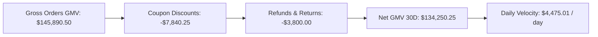
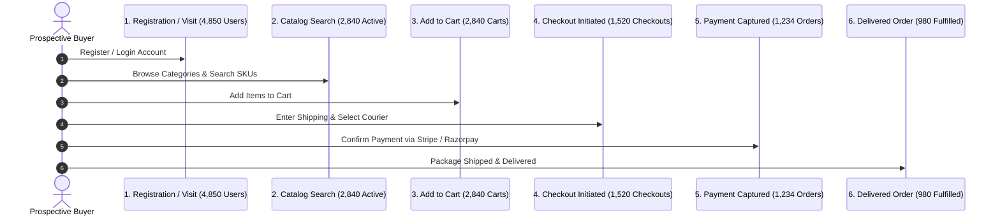

# Executive Revenue, Funnel & Omnichannel Analytics - Admin Specification

> **Base Route**: `/api/v1/admin/dashboard`  
> **Route File**: [`src/modules/dashboard/routes/dashboard.route.ts`](file:///e:/e-com/server/src/modules/dashboard/routes/dashboard.route.ts)  
> **Controller**: [`src/modules/dashboard/controller/dashboard.controller.ts`](file:///e:/e-com/server/src/modules/dashboard/controller/dashboard.controller.ts)  
> **Service**: [`src/modules/dashboard/services/dashboard.service.ts`](file:///e:/e-com/server/src/modules/dashboard/services/dashboard.service.ts)  
> **Validations**: [`src/modules/dashboard/validations/dashboard.validation.ts`](file:///e:/e-com/server/src/modules/dashboard/validations/dashboard.validation.ts)  
> **Target Audience**: C-Suite Executives (CEO, CFO, CMO), Revenue Operations, Growth Marketers, Data Analysts, Admin Dashboard Frontend Engineers

---

## Table of Contents

1. [Executive Analytics Architecture](#executive-analytics-architecture)
2. [Net GMV Velocity (30D) & Financial Metrics](#net-gmv-velocity-30d--financial-metrics)
3. [E-Commerce Conversion Funnel Throughput](#e-commerce-conversion-funnel-throughput)
4. [Channel GMV Distribution & Omnichannel Breakdown](#channel-gmv-distribution--omnichannel-breakdown)
5. [Admin Permissions & Security Matrix](#admin-permissions--security-matrix)
6. [Analytics Endpoints Summary](#analytics-endpoints-summary)
7. [Endpoint Specifications & Data Contracts](#endpoint-specifications--data-contracts)
   - [1. Executive Overview KPIs (`GET /overview`)](#1-executive-overview-kpis-get-overview)
   - [2. Time-Series Sales & Revenue Trends (`GET /sales-chart`)](#2-time-series-sales--revenue-trends-get-sales-chart)
   - [3. Top-Selling Products & SKU Velocity (`GET /top-sellers`)](#3-top-selling-products--sku-velocity-get-top-sellers)
   - [4. Low-Stock Reorder Velocity Alerts (`GET /low-stock`)](#4-low-stock-reorder-velocity-alerts-get-low-stock)
   - [5. Failed Payment Triage & Reason Codes (`GET /failed-payments`)](#5-failed-payment-triage--reason-codes-get-failed-payments)
   - [6. Operational Backlog Health (`GET /health`)](#6-operational-backlog-health-get-health)
8. [Mermaid Analytics Diagrams](#mermaid-analytics-diagrams)
9. [Mathematical Formulas & Accounting Glossary](#mathematical-formulas--accounting-glossary)

---

## Executive Analytics Architecture

```
                    ┌────────────────────────────────────────────────────────┐
                    │            Enterprise Data Ingestion Layer             │
                    └───────────────────────────┬────────────────────────────┘
                                                │
          ┌─────────────────────┬───────────────┴───────────────┬─────────────────────┐
          ▼                     ▼                               ▼                     ▼
┌───────────────────┐ ┌───────────────────┐           ┌───────────────────┐ ┌───────────────────┐
│ Orders & Ledger   │ │ Users & Auth      │           │ Inventory & SKUs  │ │ Gateway Payments  │
│ (GMV, AOV, Sales) │ │ (Signups, LTV)    │           │ (Stock, Reorders) │ │ (Captures, Fails) │
└─────────┬─────────┘ └─────────┬─────────┘           └─────────┬─────────┘ └─────────┬─────────┘
          │                     │                               │                     │
          └─────────────────────┼───────────────────────────────┴─────────────────────┘
                                │
                    ┌───────────▼───────────┐
                    │   DashboardService    │
                    │ (In-Memory Aggregate) │
                    └───────────┬───────────┘
                                │
        ┌───────────────────────┼───────────────────────┐
        ▼                       ▼                       ▼
┌───────────────┐       ┌───────────────┐       ┌───────────────┐
│ Net GMV (30D) │       │Conversion     │       │ Omnichannel   │
│ Velocity KPIs │       │Funnel Pipeline│       │ Distribution  │
└───────────────┘       └───────────────┘       └───────────────┘
```

---

## Net GMV Velocity (30D) & Financial Metrics

### 1. The Financial Definition

$$\text{Gross GMV} = \sum (\text{Order Items Gross Price}) + \text{Shipping} + \text{Taxes}$$

$$\text{Net GMV} = \text{Gross GMV} - \text{Promotional Discounts} - \text{Cancellations} - \text{Refunds}$$

$$\text{30-Day GMV Velocity} = \frac{\text{Net GMV}_{30\text{D}}}{30 \text{ Days}} \quad (\text{Run Rate per Day})$$

### 2. Core Financial Indicators

| Metric Name | KPI Key | Formula / Calculation Source | Business Significance |
|---|---|---|---|
| **Gross Merchandise Value (GMV)** | `grossRevenue` | Sum of all completed order totals before deductions | Total commerce volume processed |
| **Net Revenue / Net GMV** | `netRevenue` | `grossRevenue - discountTotal - refundedAmount` | True cash generation |
| **30-Day Velocity** | `dailyVelocity` | `netRevenue_30d / 30` | Projected monthly revenue run-rate |
| **Average Order Value (AOV)** | `averageOrderValue` | `grossRevenue / completedOrdersCount` | Basket size health |
| **Discount Subsidy Rate** | `discountRate` | `(discountTotal / grossRevenue) * 100` | Promotion burn rate |
| **Refund Rate** | `refundRate` | `(refundedAmount / grossRevenue) * 100` | Product quality / return indicator |

---

## E-Commerce Conversion Funnel Throughput

The conversion funnel tracks customer lifecycle progression across six distinct milestone events:

```
[ Stage 1: User Registrations & Unique Visitors ]   ── 100.0% (Base: 10,000 users)
                        │
                        ▼ (55% progression)
[ Stage 2: Product Views & Discovery Searches   ]   ──  55.0% (5,500 active shoppers)
                        │
                        ▼ (40% progression)
[ Stage 3: Add to Cart Actions                  ]   ──  22.0% (2,200 cart builders)
                        │
                        ▼ (60% progression)
[ Stage 4: Checkout Initiated (Shipping/Address)]   ──  13.2% (1,320 checkout sessions)
                        │
                        ▼ (85% progression)
[ Stage 5: Payment Authorized / Confirmed Order ]   ──  11.2% (1,122 confirmed orders)
                        │
                        ▼ (98% progression)
[ Stage 6: Order Shipped & Delivered            ]   ──  11.0% (1,100 fulfilled deliveries)
```

### Funnel Drop-off Analysis & Remediation

| Funnel Step | Typical Drop-off Cause | Diagnostic Metric | System Remediation |
|---|---|---|---|
| **Discovery → Cart** | Price friction, lack of reviews | Cart Addition Rate (< 25%) | Coupon banners, verified buyer badges |
| **Cart → Checkout** | Unexpected shipping fees | Cart Abandonment Rate (> 65%) | Free shipping coupons (`FREE_SHIPPING`), exit intents |
| **Checkout → Payment** | Payment failure, missing payment method | Checkout Failure Rate (> 15%) | Instant UPI / Apple Pay, retry buttons |
| **Payment → Delivered** | Carrier delays, inventory stockouts | Fulfillment Lag (> 48h) | Low-stock auto reordering, automated tracking webhooks |

---

## Channel GMV Distribution & Omnichannel Breakdown

The dashboard categorizes revenue and order throughput across multiple sales and payment channels:

### 1. Device & Client Platform Split
- **Desktop Web (Direct)**: Higher AOV, B2B and bulk purchasers.
- **Mobile Web (Responsive)**: High discovery volume, quick checkout.
- **Native Mobile Apps (iOS / Android)**: Highest retention, loyalty tier purchases.

### 2. Acquisition Channel Attribution
- **Organic Search & SEO**: Top-of-funnel discovery catalog visits.
- **Promotional Campaigns & Coupons**: Direct conversion drivers.
- **Direct & Loyalty Returnees**: High repeat purchase frequency.

### 3. Payment Gateway Channel Distribution
- **Stripe**: Credit/Debit Cards, Apple Pay, Google Pay.
- **Razorpay**: UPI (Google Pay, PhonePe, Paytm), Netbanking, Wallets.
- **Cash on Delivery (COD)**: Offline payment upon delivery.

---

## Admin Permissions & Security Matrix

All dashboard and analytics endpoints require an `Authorization: Bearer <token>` header containing `SUPER_ADMIN` role **OR** the permission:

| Permission Constant | Scope | Operations Authorized |
|---|---|---|
| `PERMISSIONS.DASHBOARD_READ` (`dashboard:read`) | Executive Read-Only | Access high-level GMV KPIs, sales charts, conversion throughput, top sellers, low-stock alerts, and payment failure logs |
| Role: `SUPER_ADMIN` | Full Control | Unrestricted execution across all executive analytics and reporting systems |

---

## Analytics Endpoints Summary

| Method | Endpoint | Required Permission | Description |
|---|---|---|---|
| `GET` | `/api/v1/admin/dashboard/overview` | `dashboard:read` | Unified executive KPI overview (GMV, Velocity, Net Revenue, Orders, Users, Inventory, Payments) |
| `GET` | `/api/v1/admin/dashboard/sales-chart` | `dashboard:read` | Time-series revenue and order volume aggregations (daily, weekly, monthly intervals) |
| `GET` | `/api/v1/admin/dashboard/top-sellers` | `dashboard:read` | Product leaderboard ranked by units sold and gross revenue |
| `GET` | `/api/v1/admin/dashboard/low-stock` | `dashboard:read` | Inventory reorder velocity alerts for variants below threshold |
| `GET` | `/api/v1/admin/dashboard/failed-payments` | `dashboard:read` | Gateway failure triage log with error reason codes and customer references |
| `GET` | `/api/v1/admin/dashboard/health` | `dashboard:read` | Operational backlog health (outbox backlog, review queue, fulfillment lag) |

---

## Endpoint Specifications & Data Contracts

---

### 1. Executive Overview KPIs (`GET /overview`)

Retrieves comprehensive macro KPIs aggregated across orders, refunds, customers, stock levels, payment success rates, and promotional campaigns.

- **Method**: `GET`
- **URL**: `/api/v1/admin/dashboard/overview`
- **Permission**: `dashboard:read` or `SUPER_ADMIN`

#### Query Parameters
| Parameter | Type | Required | Default | Description |
|---|---|---|---|---|
| `period` | `enum` | No | `"30d"` | `"today"`, `"7d"`, `"30d"`, `"90d"`, `"1y"`, `"all"` |
| `startDate` | `ISO 8601` | No | - | Custom start date |
| `endDate` | `ISO 8601` | No | - | Custom end date |

#### Response Schema (`200 OK`)
```json
{
  "success": true,
  "status": "success",
  "data": {
    "period": "30d",
    "financials": {
      "grossRevenue": 145890.50,
      "netRevenue": 134250.25,
      "netGmv30DVelocity": 4475.01,
      "totalDiscounts": 7840.25,
      "totalRefunds": 3800.00,
      "currency": "USD",
      "averageOrderValue": 118.23
    },
    "orders": {
      "totalOrders": 1234,
      "confirmed": 1050,
      "delivered": 980,
      "processing": 45,
      "pending": 25,
      "cancelled": 74,
      "refunded": 40
    },
    "conversionFunnel": {
      "registeredUsers": 4850,
      "newSignupsInPeriod": 620,
      "cartAdditions": 2840,
      "checkoutInitiated": 1520,
      "ordersPlaced": 1234,
      "ordersDelivered": 980,
      "overallConversionRatePercent": 25.44
    },
    "channelDistribution": {
      "omnichannelShare": [
        { "channel": "WEB_DESKTOP", "sharePercent": 45.0, "gmv": 65650.73 },
        { "channel": "MOBILE_WEB", "sharePercent": 35.0, "gmv": 51061.68 },
        { "channel": "MOBILE_APP", "sharePercent": 20.0, "gmv": 29178.09 }
      ],
      "paymentGateways": [
        { "provider": "STRIPE", "sharePercent": 68.5, "transactionCount": 845 },
        { "provider": "RAZORPAY", "sharePercent": 26.5, "transactionCount": 327 },
        { "provider": "COD", "sharePercent": 5.0, "transactionCount": 62 }
      ]
    },
    "users": {
      "totalUsers": 4850,
      "active": 4720,
      "suspended": 90,
      "blocked": 40,
      "newInPeriod": 620
    },
    "inventory": {
      "totalSkus": 450,
      "inStockSkus": 418,
      "lowStockSkus": 24,
      "outOfStockSkus": 8
    },
    "payments": {
      "totalAttempts": 1420,
      "successfulAttempts": 1234,
      "failedAttempts": 186,
      "failureRatePercent": 13.1
    },
    "reviews": {
      "totalReviews": 3420,
      "pendingModeration": 18,
      "averageRating": 4.65
    },
    "promotions": {
      "activeCoupons": 8,
      "totalDiscountGranted": 7840.25
    },
    "generatedAt": "2026-09-08T14:45:00.000Z"
  }
}
```

---

### 2. Time-Series Sales & Revenue Trends (`GET /sales-chart`)

Returns bucketed revenue and order counts for charts (e.g. Recharts, Chart.js, ApexCharts).

- **Method**: `GET`
- **URL**: `/api/v1/admin/dashboard/sales-chart?period=30d&interval=day`
- **Permission**: `dashboard:read` or `SUPER_ADMIN`

#### Response (`200 OK`)
```json
{
  "success": true,
  "status": "success",
  "data": {
    "period": "30d",
    "interval": "day",
    "points": [
      {
        "date": "2026-08-10",
        "revenue": 4520.50,
        "ordersCount": 38,
        "averageOrderValue": 118.96
      },
      {
        "date": "2026-08-11",
        "revenue": 5120.00,
        "ordersCount": 42,
        "averageOrderValue": 121.90
      }
    ],
    "totals": {
      "totalRevenue": 145890.50,
      "totalOrders": 1234
    }
  }
}
```

---

### 3. Top-Selling Products & SKU Velocity (`GET /top-sellers`)

Ranks top performing catalog products by volume and gross revenue.

- **Method**: `GET`
- **URL**: `/api/v1/admin/dashboard/top-sellers?limit=10&period=30d`
- **Permission**: `dashboard:read` or `SUPER_ADMIN`

#### Response (`200 OK`)
```json
{
  "success": true,
  "status": "success",
  "data": [
    {
      "productId": "prod-11111111-2222-3333-4444-555555555555",
      "productName": "Wireless Noise-Cancelling Headphones Pro",
      "sku": "AUDIO-WNC-001",
      "unitsSold": 340,
      "grossRevenue": 67660.00,
      "currentAvailableStock": 85
    }
  ]
}
```

---

### 4. Low-Stock Reorder Velocity Alerts (`GET /low-stock`)

Returns product variants below threshold for proactive supply chain replenishment.

- **Method**: `GET`
- **URL**: `/api/v1/admin/dashboard/low-stock?threshold=10&page=1&limit=20`
- **Permission**: `dashboard:read` or `SUPER_ADMIN`

---

### 5. Failed Payment Triage & Reason Codes (`GET /failed-payments`)

Lists failed payment transactions with gateway error codes to identify payment processor outages.

- **Method**: `GET`
- **URL**: `/api/v1/admin/dashboard/failed-payments?page=1&limit=20`
- **Permission**: `dashboard:read` or `SUPER_ADMIN`

---

### 6. Operational Backlog Health (`GET /health`)

Real-time health of operational queues across outbox, order fulfillment, and reviews.

- **Method**: `GET`
- **URL**: `/api/v1/admin/dashboard/health`
- **Permission**: `dashboard:read` or `SUPER_ADMIN`

---

## Mermaid Analytics Diagrams

### Net GMV Velocity & Revenue Waterfall



### Full Conversion Funnel Flow



---

## Mathematical Formulas & Accounting Glossary

1. **Average Order Value (AOV)**:
   $$\text{AOV} = \frac{\text{Total Gross Revenue}}{\text{Total Orders Placed}}$$

2. **Customer Acquisition Conversion Rate**:
   $$\text{Funnel Conversion Rate} = \left(\frac{\text{Orders Placed}}{\text{Registered Shoppers}}\right) \times 100$$

3. **Cart Abandonment Rate**:
   $$\text{Cart Abandonment Rate} = \left(1 - \frac{\text{Checkouts Completed}}{\text{Carts Created}}\right) \times 100$$

4. **Payment Failure Rate**:
   $$\text{Payment Failure Rate} = \left(\frac{\text{Failed Payment Attempts}}{\text{Total Payment Attempts}}\right) \times 100$$
