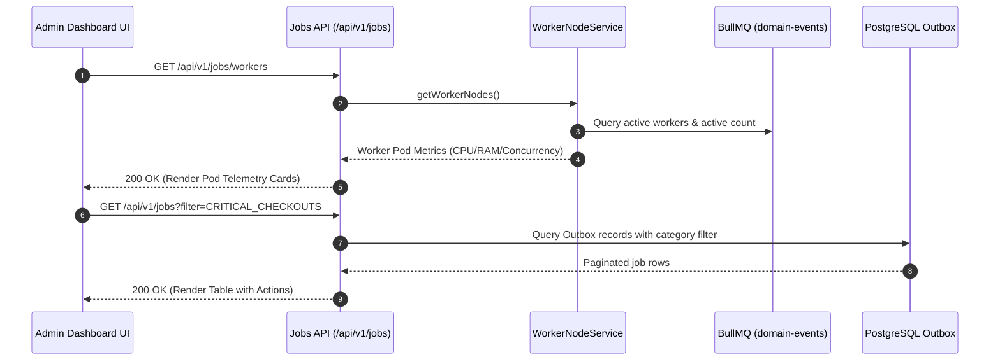
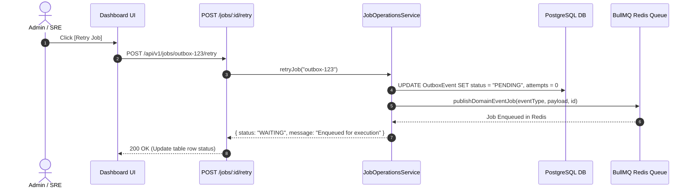

# Background Jobs & Worker Observability Module Documentation

> **Base Route**: `/api/v1/jobs`  
> **Route Definition**: [`src/modules/jobs/routes/job.route.ts`](file:///e:/e-com/server/src/modules/jobs/routes/job.route.ts)  
> **Controller**: [`src/modules/jobs/controller/job.controller.ts`](file:///e:/e-com/server/src/modules/jobs/controller/job.controller.ts)  
> **Services**: [`src/modules/jobs/services/`](file:///e:/e-com/server/src/modules/jobs/services/)  
> **Validation Schemas**: [`src/modules/jobs/validations/job.validation.ts`](file:///e:/e-com/server/src/modules/jobs/validations/job.validation.ts)  
> **Queue Driver**: [`src/lib/queue.ts`](file:///e:/e-com/server/src/lib/queue.ts) (BullMQ + Redis)  
> **Admin Operations Guide**: [`ADMIN_BACKGROUND_JOBS.README.md`](file:///e:/e-com/server/src/modules/jobs/ADMIN_BACKGROUND_JOBS.README.md)

---

## Table of Contents

1. [Architecture & System Overview](#architecture--system-overview)
2. [Worker Nodes Telemetry & Pod Health](#worker-nodes-telemetry--pod-health)
3. [Queue Filtering Categories](#queue-filtering-categories)
4. [Endpoints Summary](#endpoints-summary)
5. [Endpoint Specifications & Scenarios](#endpoint-specifications--scenarios)
   - [1. Background Jobs Overview & Throughput (`GET /overview`)](#1-background-jobs-overview--throughput-get-overview)
   - [2. Worker Nodes Health Telemetry (`GET /workers`)](#2-worker-nodes-health-telemetry-get-workers)
   - [3. List Background Jobs for Table View (`GET /`)](#3-list-background-jobs-for-table-view-get-)
   - [4. Inspect Job Details (`GET /:id`)](#4-inspect-job-details-get-id)
   - [5. Retry Job (`POST /:id/retry`)](#5-retry-job-post-idretry)
   - [6. Cancel Job (`POST /:id/cancel`)](#6-cancel-job-post-idcancel)
   - [7. Bulk Queue Actions (`POST /bulk-action`)](#7-bulk-queue-actions-post-bulk-action)
6. [Architecture & Sequence Diagrams](#architecture--sequence-diagrams)
   - [Worker Telemetry & Job Lifecycle Loop](#worker-telemetry--job-lifecycle-loop)
   - [Manual & Bulk Retry Execution Flow](#manual--bulk-retry-execution-flow)
7. [Frontend Dashboard Integration (React / Next.js)](#frontend-dashboard-integration-react--nextjs)
8. [Error Handling & Diagnostic Codes](#error-handling--diagnostic-codes)

---

## Architecture & System Overview

The **Background Jobs** module provides real-time observability, telemetry, and administrative control over asynchronous background workers, BullMQ queues, worker nodes/pods, and the transactional outbox subsystem.

### Service Decomposition

- [`workerNode.service.ts`](file:///e:/e-com/server/src/modules/jobs/services/workerNode.service.ts): Gathers CPU %, memory (heap/RSS/system total), active worker threads, active concurrency limit, uptime, and node health status (`HEALTHY`, `DEGRADED`, `OFFLINE`).
- [`jobOverview.service.ts`](file:///e:/e-com/server/src/modules/jobs/services/jobOverview.service.ts): Computes active jobs in flight, throttled jobs, jobs processed, success rate, execution latencies (p50, p95 ms), and Dead Letter Queue (DLQ) depth.
- [`jobList.service.ts`](file:///e:/e-com/server/src/modules/jobs/services/jobList.service.ts): Formats jobs into the standard table schema with Status, Job ID, Handler, Queue, Worker Pod, Runtime, Attempt, and Actions.
- [`jobOperations.service.ts`](file:///e:/e-com/server/src/modules/jobs/services/jobOperations.service.ts): Handles single-job retries, cancellations, detail inspections, and bulk queue operations.

---

## Worker Nodes Telemetry & Pod Health

Admins can monitor live resource consumption and capacity across worker pods:

```
┌────────────────────────────────────────────────────────┐
│               Worker Node: worker-prod-az1             │
│            Pod: worker-pod-az1-21840 (PID: 21840)      │
├────────────────────────────┬───────────────────────────┤
│ Status: HEALTHY            │ CPU Utilization: 18%      │
│ RSS Memory: 142.5 MB       │ Heap Used: 64.2 MB (65%)  │
│ System RAM: 8.0 / 16.0 GB  │ Concurrency Limit: 10     │
│ Active Concurrency: 2 jobs │ Uptime: 1d 4h 12m 30s     │
└────────────────────────────┴───────────────────────────┘
```

---

## Queue Filtering Categories

| Filter Key | Filter Label | Scope |
|---|---|---|
| `ALL` | **All Queues** | Aggregated view of all asynchronous domain tasks |
| `CRITICAL_CHECKOUTS` | **Critical Checkouts** | Order placements, checkout payments, transaction captures |
| `ORDER_FULFILLMENT_SYNC` | **Order Fulfillment Sync** | Shipping carrier tracking updates, delivery confirmations |
| `MARKETING_EMAIL_BATCH` | **Marketing Email Batch** | Promotional blasts, coupon announcements, stock notifications |
| `DEAD_LETTER_TRIGGER` | **Dead Letter Trigger** | Poison pill jobs or tasks exceeding maximum retries (DLQ) |

---

## Endpoints Summary

| Method | Endpoint | Required Permission | Description |
|---|---|---|---|
| `GET` | `/api/v1/jobs/overview` | `system:manage` | Active in-flight count, throttled jobs, latencies, DLQ depth |
| `GET` | `/api/v1/jobs/workers` | `system:manage` | Worker pods, CPU/RAM utilization %, active concurrency |
| `GET` | `/api/v1/jobs` | `system:manage` | Filterable jobs list formatted for interactive UI tables |
| `GET` | `/api/v1/jobs/:id` | `system:manage` | Detailed JSON payload, error traces, and consumer logs |
| `POST` | `/api/v1/jobs/:id/retry` | `system:manage` | Reset attempt counter and re-queue job for execution |
| `POST` | `/api/v1/jobs/:id/cancel` | `system:manage` | Discard active or pending job |
| `POST` | `/api/v1/jobs/bulk-action` | `system:manage` | Bulk queue operations (Retry all failed, purge DLQ) |

---

## Endpoint Specifications & Scenarios

---

### 1. Background Jobs Overview & Throughput (`GET /overview`)

- **Method**: `GET`
- **URL**: `/api/v1/jobs/overview`
- **Permission**: `system:manage` or `SUPER_ADMIN`

#### Response (`200 OK`)
```json
{
  "status": "success",
  "data": {
    "summary": {
      "activeJobsInFlight": 14,
      "throttledJobs": 2,
      "jobsProcessedTotal": 18450,
      "jobsSucceeded": 18442,
      "jobsFailed": 8,
      "successRatePercent": 99.96,
      "averageExecutionLatencyMs": 42.5,
      "p95ExecutionLatencyMs": 128.0,
      "deadLetterQueueDepth": 3,
      "deadLetterTriggered": true
    },
    "workerNodes": {
      "totalNodes": 1,
      "healthyNodes": 1,
      "degradedNodes": 0,
      "totalActiveConcurrency": 10
    },
    "queues": [
      {
        "name": "domain-events",
        "category": "CRITICAL_CHECKOUTS",
        "waiting": 2,
        "active": 1,
        "completed": 12400,
        "failed": 0,
        "delayed": 0,
        "status": "HEALTHY"
      }
    ],
    "timestamp": "2026-09-08T14:40:00.000Z"
  }
}
```

---

### 2. Worker Nodes Health Telemetry (`GET /workers`)

- **Method**: `GET`
- **URL**: `/api/v1/jobs/workers`
- **Permission**: `system:manage` or `SUPER_ADMIN`

#### Response (`200 OK`)
```json
{
  "status": "success",
  "data": [
    {
      "nodeId": "node-worker-prod-az1-01",
      "podName": "worker-pod-az1-21840",
      "hostname": "worker-prod-az1-01",
      "status": "HEALTHY",
      "cpuUtilizationPercent": 18,
      "memoryUtilization": {
        "rssMb": 142.5,
        "heapUsedMb": 64.2,
        "heapTotalMb": 98.4,
        "systemTotalMb": 16384.0,
        "systemFreeMb": 8192.0,
        "percentUsed": 50.0
      },
      "concurrency": {
        "limit": 10,
        "activeWorkers": 1,
        "activeJobs": 2
      },
      "uptimeSeconds": 86400,
      "uptimeHuman": "1d 0h 0m 0s",
      "lastHeartbeat": "2026-09-08T14:40:00.000Z"
    }
  ]
}
```

---

### 3. List Background Jobs for Table View (`GET /`)

- **Method**: `GET`
- **URL**: `/api/v1/jobs?filter=CRITICAL_CHECKOUTS&status=ACTIVE&page=1&limit=20`
- **Permission**: `system:manage` or `SUPER_ADMIN`

#### Response (`200 OK`)
```json
{
  "status": "success",
  "data": {
    "items": [
      {
        "id": "outbox-11111111-2222-3333-4444-555555555555",
        "jobId": "outbox-11111111-2222-3333-4444-555555555555",
        "status": "COMPLETED",
        "handler": "orderEventsConsumer",
        "queue": "domain-events",
        "category": "CRITICAL_CHECKOUTS",
        "worker": "worker-pod-az1-21840",
        "runtime": "48 ms",
        "runtimeMs": 48,
        "attempt": "1/10",
        "attemptsCount": 1,
        "maxAttempts": 10,
        "payloadSummary": "{\"orderId\":\"ord-2222\",\"orderNumber\":\"ORD-1001\"}",
        "failedReason": null,
        "createdAt": "2026-09-08T14:30:00.000Z",
        "processedAt": "2026-09-08T14:30:00.048Z",
        "actions": ["INSPECT"]
      }
    ],
    "pagination": {
      "page": 1,
      "limit": 20,
      "total": 1,
      "totalPages": 1
    }
  }
}
```

---

### 4. Inspect Job Details (`GET /:id`)

- **Method**: `GET`
- **URL**: `/api/v1/jobs/:id`
- **Permission**: `system:manage` or `SUPER_ADMIN`

---

### 5. Retry Job (`POST /:id/retry`)

- **Method**: `POST`
- **URL**: `/api/v1/jobs/:id/retry`
- **Permission**: `system:manage` or `SUPER_ADMIN`

---

### 6. Cancel Job (`POST /:id/cancel`)

- **Method**: `POST`
- **URL**: `/api/v1/jobs/:id/cancel`
- **Permission**: `system:manage` or `SUPER_ADMIN`

---

### 7. Bulk Queue Actions (`POST /bulk-action`)

- **Method**: `POST`
- **URL**: `/api/v1/jobs/bulk-action`
- **Body**: `{"action": "RETRY_ALL_FAILED"}`
- **Permission**: `system:manage` or `SUPER_ADMIN`

---

## Architecture & Sequence Diagrams

### Worker Telemetry & Job Lifecycle Loop



### Manual & Bulk Retry Execution Flow



---

## Frontend Dashboard Integration (React / Next.js)

```tsx
import { useState, useEffect } from "react";

export function BackgroundJobsDashboard() {
  const [filter, setFilter] = useState("ALL");
  const [overview, setOverview] = useState<any>(null);
  const [jobs, setJobs] = useState<any[]>([]);

  useEffect(() => {
    // 1. Fetch Overview KPIs
    fetch("/api/v1/jobs/overview").then(res => res.json()).then(data => setOverview(data.data));
  }, []);

  useEffect(() => {
    // 2. Fetch Jobs Table
    fetch(`/api/v1/jobs?filter=${filter}`).then(res => res.json()).then(data => setJobs(data.data.items));
  }, [filter]);

  const handleRetry = async (jobId: string) => {
    await fetch(`/api/v1/jobs/${jobId}/retry`, { method: "POST" });
    // Refresh table
    const res = await fetch(`/api/v1/jobs?filter=${filter}`);
    const json = await res.json();
    setJobs(json.data.items);
  };

  return (
    <div className="jobs-container">
      {/* 1. KPI Cards */}
      <div className="kpi-grid">
        <div className="card">Active in Flight: {overview?.summary.activeJobsInFlight}</div>
        <div className="card">Throttled Jobs: {overview?.summary.throttledJobs}</div>
        <div className="card">Avg Latency: {overview?.summary.averageExecutionLatencyMs} ms</div>
        <div className="card">DLQ Depth: {overview?.summary.deadLetterQueueDepth}</div>
      </div>

      {/* 2. Queue Category Tabs */}
      <div className="tabs">
        {["ALL", "CRITICAL_CHECKOUTS", "ORDER_FULFILLMENT_SYNC", "MARKETING_EMAIL_BATCH", "DEAD_LETTER_TRIGGER"].map((f) => (
          <button key={f} className={filter === f ? "active" : ""} onClick={() => setFilter(f)}>
            {f.replace(/_/g, " ")}
          </button>
        ))}
      </div>

      {/* 3. Jobs Table */}
      <table>
        <thead>
          <tr>
            <th>Status</th>
            <th>Job ID</th>
            <th>Handler</th>
            <th>Queue</th>
            <th>Worker</th>
            <th>Runtime</th>
            <th>Attempt</th>
            <th>Actions</th>
          </tr>
        </thead>
        <tbody>
          {jobs.map((job) => (
            <tr key={job.id}>
              <td><span className={`badge ${job.status}`}>{job.status}</span></td>
              <td>{job.jobId}</td>
              <td>{job.handler}</td>
              <td>{job.queue}</td>
              <td>{job.worker}</td>
              <td>{job.runtime}</td>
              <td>{job.attempt}</td>
              <td>
                {job.actions.includes("RETRY") && (
                  <button onClick={() => handleRetry(job.id)}>Retry</button>
                )}
              </td>
            </tr>
          ))}
        </tbody>
      </table>
    </div>
  );
}
```

---

## Error Handling & Diagnostic Codes

| HTTP Status | Error Type | Cause / Recommended Action |
|---|---|---|
| `400 Bad Request` | `INVALID_JOB_STATE` | Attempting to retry a completed job or cancel already processed job |
| `401 Unauthorized` | `UNAUTHENTICATED` | Missing or expired JWT Bearer token |
| `403 Forbidden` | `FORBIDDEN` | Requires `system:manage` permission or `SUPER_ADMIN` role |
| `404 Not Found` | `JOB_NOT_FOUND` | Job UUID not found in outbox or queue storage |
