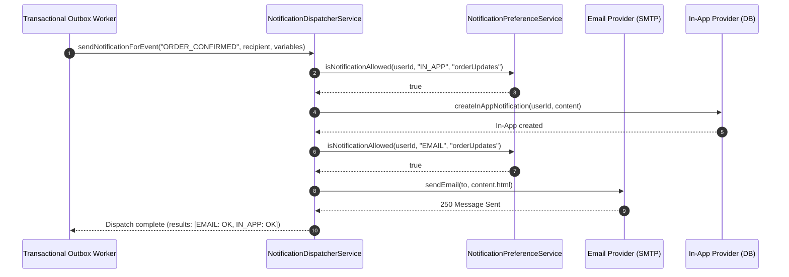
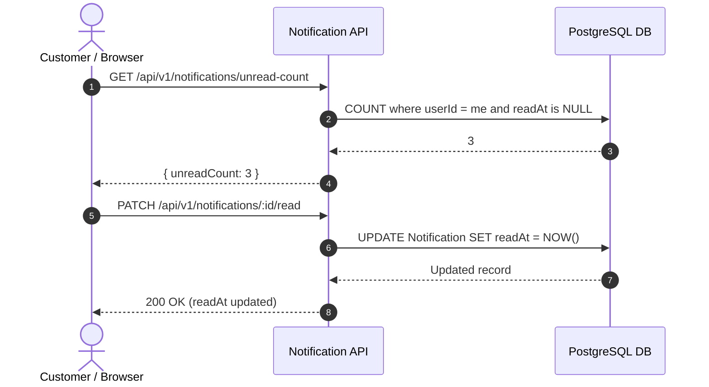

# Notifications & Preferences Module API Documentation

> **Base Route**: `/api/v1/notifications`  
> **Route Definition**: [`src/modules/notifications/routes/notification.route.ts`](file:///e:/e-com/server/src/modules/notifications/routes/notification.route.ts)  
> **Controller**: [`src/modules/notifications/controller/notification.controller.ts`](file:///e:/e-com/server/src/modules/notifications/controller/notification.controller.ts)  
> **Services**: [`src/modules/notifications/services/`](file:///e:/e-com/server/src/modules/notifications/services/)  
> **Validation Schemas**: [`src/modules/notifications/validations/notification.validation.ts`](file:///e:/e-com/server/src/modules/notifications/validations/notification.validation.ts)  
> **Admin Guide**: [`ADMIN_NOTIFICATIONS.README.md`](file:///e:/e-com/server/src/modules/notifications/ADMIN_NOTIFICATIONS.README.md)

---

## Table of Contents

1. [Architecture & System Overview](#architecture--system-overview)
2. [Supported Communication Channels](#supported-communication-channels)
3. [User Preferences & Category Subscriptions](#user-preferences--category-subscriptions)
4. [Endpoints Summary](#endpoints-summary)
5. [Customer / Authenticated User Endpoints](#customer--authenticated-user-endpoints)
   - [1. List My Notifications (`GET /`)](#1-list-my-notifications-get-)
   - [2. Get Unread Notification Count (`GET /unread-count`)](#2-get-unread-notification-count-get-unread-count)
   - [3. Mark Notification as Read (`PATCH /:id/read`)](#3-mark-notification-as-read-patch-idread)
   - [4. Mark All Notifications as Read (`POST /mark-all-read`)](#4-mark-all-notifications-as-read-post-mark-all-read)
   - [5. Dismiss / Delete Notification (`DELETE /:id`)](#5-dismiss--delete-notification-delete-id)
   - [6. Get My Notification Preferences (`GET /preferences`)](#6-get-my-notification-preferences-get-preferences)
   - [7. Update My Notification Preferences (`PUT /preferences`)](#7-update-my-notification-preferences-put-preferences)
6. [Administrative Endpoints](#administrative-endpoints)
   - [8. Dispatch Notification (`POST /send`)](#8-dispatch-notification-post-send)
   - [9. Retry Failed Delivery (`POST /:id/retry`)](#9-retry-failed-delivery-post-idretry)
7. [Flow Diagrams](#flow-diagrams)
   - [Event-Driven Notification Dispatch Flow](#event-driven-notification-dispatch-flow)
   - [Customer In-App Feed & Read Lifecycle](#customer-in-app-feed--read-lifecycle)
8. [Frontend React Component Integration](#frontend-react-component-integration)
9. [Error Codes & Diagnostics](#error-codes--diagnostics)

---

## Architecture & System Overview

The Notifications module provides a unified multi-channel communication engine supporting **In-App Notification Inboxes**, **Transactional Emails**, and **Mobile Push Notifications**.

### Key Architectural Features

- **Domain Event Integration**: Automatically ingests asynchronous events from the Transactional Outbox pattern (`ORDER_CONFIRMED`, `ORDER_SHIPPED`, `PAYMENT_SUCCESS`, `LOW_STOCK`).
- **User Preference Enforcement**: Checks customer opt-in settings per channel and category prior to dispatch, preventing unwanted messaging.
- **Persistent In-App Inbox**: Stores in-app messages with read/unread tracking and instantaneous badge counter updates.
- **Delivery Logging & Failure Recovery**: Captures SMTP/Push delivery statuses and provides administrative retry endpoints to heal failed deliveries.

---

## Supported Communication Channels

| Channel | Driver / Transport | Use Cases |
|---|---|---|
| `IN_APP` | PostgreSQL Feed (`Notification` table) | In-app notification bell, order status updates, interactive announcements |
| `EMAIL` | Resend / Nodemailer / SMTP | Invoices, order confirmations, receipts, security alerts |
| `PUSH` | Firebase Cloud Messaging (FCM) / Web Push | Time-sensitive delivery tracking, flash sales |

---

## User Preferences & Category Subscriptions

Users can granularly control both the **channels** they receive messages on and the **categories** they subscribe to:

### Channels
- `emailEnabled`: Enable/disable all non-critical emails.
- `pushEnabled`: Enable/disable mobile & web push notifications.
- `inAppEnabled`: Enable/disable in-app bell feed.

### Categories
- `orderUpdates`: Order placed, confirmed, shipped, delivered, payment receipts.
- `promotions`: Discounts, coupon launches, marketing campaigns.
- `securityAlerts`: Password reset requests, new device logins, email changes.
- `lowStockAlerts`: Merchant / inventory alerts for low quantity thresholds.

---

## Endpoints Summary

| Method | Endpoint | Auth Required | Description |
|---|---|---|---|
| `GET` | `/api/v1/notifications` | User (`app.authenticate`) | List user's notification feed with filters and pagination |
| `GET` | `/api/v1/notifications/unread-count` | User (`app.authenticate`) | Fast count of unread in-app notifications for bell badges |
| `PATCH`| `/api/v1/notifications/:id/read` | User (`app.authenticate`) | Mark a specific notification as read |
| `POST` | `/api/v1/notifications/mark-all-read` | User (`app.authenticate`) | Mark all unread notifications as read in a single batch |
| `DELETE`| `/api/v1/notifications/:id` | User (`app.authenticate`) | Permanently dismiss/delete an in-app notification |
| `GET` | `/api/v1/notifications/preferences` | User (`app.authenticate`) | View user's communication settings and category opt-ins |
| `PUT` | `/api/v1/notifications/preferences` | User (`app.authenticate`) | Update user's communication settings and opt-ins |
| `POST` | `/api/v1/notifications/send` | Admin (`system:manage`) | Manual or broadcast dispatch across selected channels |
| `POST` | `/api/v1/notifications/:id/retry` | Admin (`system:manage`) | Retry a previously failed email or push delivery |

---

## Customer / Authenticated User Endpoints

---

### 1. List My Notifications (`GET /`)

Retrieves the authenticated user's notification feed with unread filter, channel filter, and pagination.

- **Method**: `GET`
- **URL**: `/api/v1/notifications`
- **Authentication**: Required (`Authorization: Bearer <token>`)

#### Query Parameters
| Parameter | Type | Required | Default | Description |
|---|---|---|---|---|
| `unreadOnly` | `boolean` | No | `false` | If `true`, returns only unread notifications |
| `type` | `string` | No | - | Filter by event type (e.g. `ORDER_CONFIRMED`) |
| `channel` | `enum` | No | `IN_APP` | `EMAIL`, `PUSH`, `IN_APP` |
| `page` | `integer` | No | `1` | Page number |
| `limit` | `integer` | No | `20` | Max results per page (Max: 100) |

#### Scenarios

##### Scenario 1.A: Success (`200 OK`)
```json
{
  "status": "success",
  "data": {
    "items": [
      {
        "id": "notif-11111111-2222-3333-4444-555555555555",
        "userId": "usr-11111111-2222-3333-4444-555555555555",
        "type": "ORDER_CONFIRMED",
        "title": "Order Confirmed!",
        "body": "Hello John Doe, your order #ORD-20260908-1001 has been confirmed.",
        "channel": "IN_APP",
        "status": "SENT",
        "readAt": null,
        "createdAt": "2026-09-08T12:00:00.000Z"
      }
    ],
    "pagination": {
      "page": 1,
      "limit": 20,
      "total": 1,
      "totalPages": 1
    }
  }
}
```

---

### 2. Get Unread Notification Count (`GET /unread-count`)

Returns the exact count of unread in-app notifications for bell icon badge rendering.

- **Method**: `GET`
- **URL**: `/api/v1/notifications/unread-count`
- **Authentication**: Required (`Authorization: Bearer <token>`)

#### Scenarios

##### Scenario 2.A: Success (`200 OK`)
```json
{
  "status": "success",
  "data": {
    "unreadCount": 3
  }
}
```

---

### 3. Mark Notification as Read (`PATCH /:id/read`)

Marks a specific in-app notification as read by populating `readAt` timestamp.

- **Method**: `PATCH`
- **URL**: `/api/v1/notifications/:id/read`
- **Authentication**: Required (`Authorization: Bearer <token>`)

#### Scenarios

##### Scenario 3.A: Success (`200 OK`)
```json
{
  "status": "success",
  "message": "Notification marked as read",
  "data": {
    "id": "notif-11111111-2222-3333-4444-555555555555",
    "readAt": "2026-09-08T14:20:00.000Z"
  }
}
```

---

### 4. Mark All Notifications as Read (`POST /mark-all-read`)

Marks all unread in-app notifications for the authenticated user as read in a single batch operation.

- **Method**: `POST`
- **URL**: `/api/v1/notifications/mark-all-read`
- **Authentication**: Required (`Authorization: Bearer <token>`)

#### Scenarios

##### Scenario 4.A: Success (`200 OK`)
```json
{
  "status": "success",
  "message": "Marked 3 notification(s) as read",
  "data": {
    "count": 3
  }
}
```

---

### 5. Dismiss / Delete Notification (`DELETE /:id`)

Permanently deletes an in-app notification from the user's feed.

- **Method**: `DELETE`
- **URL**: `/api/v1/notifications/:id`
- **Authentication**: Required (`Authorization: Bearer <token>`)

#### Scenarios

##### Scenario 5.A: Success (`200 OK`)
```json
{
  "status": "success",
  "message": "Notification deleted",
  "data": {
    "id": "notif-11111111-2222-3333-4444-555555555555"
  }
}
```

---

### 6. Get My Notification Preferences (`GET /preferences`)

Retrieves channel opt-ins and category preferences for the authenticated user.

- **Method**: `GET`
- **URL**: `/api/v1/notifications/preferences`
- **Authentication**: Required (`Authorization: Bearer <token>`)

#### Scenarios

##### Scenario 6.A: Success (`200 OK`)
```json
{
  "status": "success",
  "data": {
    "id": "pref-11111111-2222-3333-4444-555555555555",
    "userId": "usr-11111111-2222-3333-4444-555555555555",
    "emailEnabled": true,
    "pushEnabled": true,
    "inAppEnabled": true,
    "orderUpdates": true,
    "promotions": true,
    "securityAlerts": true,
    "lowStockAlerts": false
  }
}
```

---

### 7. Update My Notification Preferences (`PUT /preferences`)

Updates opt-in/opt-out channel and event preferences for the authenticated user.

- **Method**: `PUT`
- **URL**: `/api/v1/notifications/preferences`
- **Authentication**: Required (`Authorization: Bearer <token>`)

#### Request Body Schema
```json
{
  "emailEnabled": true,
  "pushEnabled": false,
  "promotions": false
}
```

#### Scenarios

##### Scenario 7.A: Success (`200 OK`)
```json
{
  "status": "success",
  "message": "Notification preferences updated successfully",
  "data": {
    "id": "pref-11111111-2222-3333-4444-555555555555",
    "userId": "usr-11111111-2222-3333-4444-555555555555",
    "emailEnabled": true,
    "pushEnabled": false,
    "inAppEnabled": true,
    "orderUpdates": true,
    "promotions": false,
    "securityAlerts": true,
    "lowStockAlerts": false
  }
}
```

---

## Administrative Endpoints

*(For detailed schemas and error handling, refer to [`ADMIN_NOTIFICATIONS.README.md`](file:///e:/e-com/server/src/modules/notifications/ADMIN_NOTIFICATIONS.README.md))*

### 8. Dispatch Notification (`POST /send`)
- **Permission**: `system:manage`
- **URL**: `/api/v1/notifications/send`

### 9. Retry Failed Delivery (`POST /:id/retry`)
- **Permission**: `system:manage`
- **URL**: `/api/v1/notifications/:id/retry`

---

## Flow Diagrams

### Event-Driven Notification Dispatch Flow



### Customer In-App Feed & Read Lifecycle



---

## Frontend React Component Integration

### Notification Bell Badge & Dropdown Feed

```tsx
import { useState, useEffect } from "react";

export function NotificationBell() {
  const [unreadCount, setUnreadCount] = useState(0);
  const [notifications, setNotifications] = useState([]);
  const [isOpen, setIsOpen] = useState(false);

  useEffect(() => {
    // 1. Fetch unread count
    fetch("/api/v1/notifications/unread-count")
      .then((res) => res.json())
      .then((data) => setUnreadCount(data.data.unreadCount));
  }, []);

  const openDropdown = async () => {
    setIsOpen(!isOpen);
    if (!isOpen) {
      const res = await fetch("/api/v1/notifications?limit=5");
      const json = await res.json();
      setNotifications(json.data.items);
    }
  };

  const markAllRead = async () => {
    await fetch("/api/v1/notifications/mark-all-read", { method: "POST" });
    setUnreadCount(0);
    setNotifications((prev) => prev.map((n) => ({ ...n, readAt: new Date().toISOString() })));
  };

  return (
    <div className="relative">
      <button onClick={openDropdown} className="relative p-2">
        🔔 {unreadCount > 0 && <span className="badge">{unreadCount}</span>}
      </button>
      {isOpen && (
        <div className="dropdown">
          <button onClick={markAllRead}>Mark All as Read</button>
          {notifications.map((n: any) => (
            <div key={n.id} className={n.readAt ? "read" : "unread"}>
              <h4>{n.title}</h4>
              <p>{n.body}</p>
            </div>
          ))}
        </div>
      )}
    </div>
  );
}
```

---

## Error Codes & Diagnostics

| HTTP Status | Reason | Action Required |
|---|---|---|
| `400 Bad Request` | Invalid payload or params | Check schema constraints in request body |
| `401 Unauthorized` | Missing authentication | Provide valid Bearer token in `Authorization` header |
| `403 Forbidden` | Insufficient permissions | Admin endpoints require `system:manage` permission |
| `404 Not Found` | Notification not found | Ensure notification ID exists and belongs to current user |
