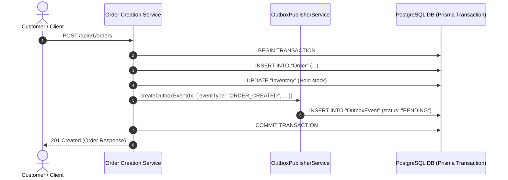
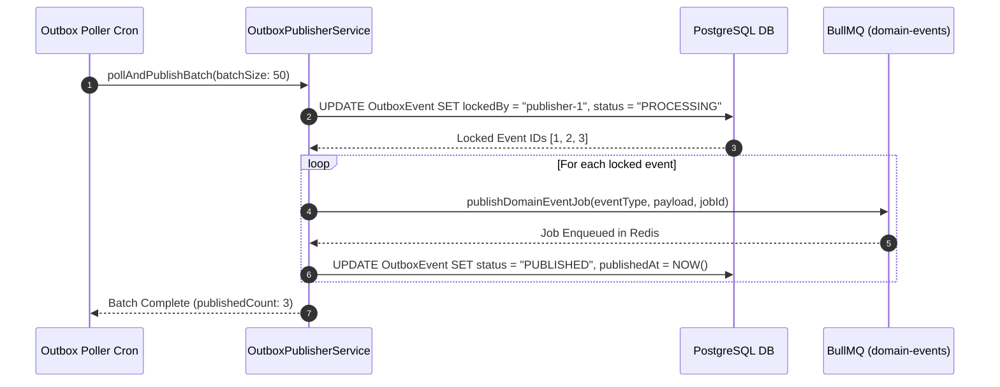
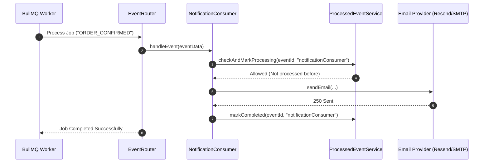
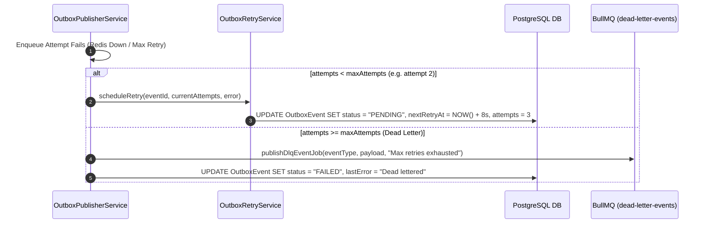

# Transactional Outbox & Background Jobs - Architecture & Integration Guide

> **Base Route**: `/api/v1/outbox`  
> **Route Definition**: [`src/modules/outbox/routes/outbox.route.ts`](file:///e:/e-com/server/src/modules/outbox/routes/outbox.route.ts)  
> **Controller**: [`src/modules/outbox/controller/outbox.controller.ts`](file:///e:/e-com/server/src/modules/outbox/controller/outbox.controller.ts)  
> **Services**: [`src/modules/outbox/services/`](file:///e:/e-com/server/src/modules/outbox/services/)  
> **Queue Engine**: [`src/lib/queue.ts`](file:///e:/e-com/server/src/lib/queue.ts) (BullMQ + Redis)  
> **Event Consumers**: [`src/modules/outbox/handlers/consumers/`](file:///e:/e-com/server/src/modules/outbox/handlers/consumers/)  
> **Admin Guide**: [`ADMIN_OUTBOX.README.md`](file:///e:/e-com/server/src/modules/outbox/ADMIN_OUTBOX.README.md)

---

## Table of Contents

1. [Background Jobs & Outbox Pattern Overview](#background-jobs--outbox-pattern-overview)
2. [Component Architecture](#component-architecture)
3. [Event Catalog & Taxonomy](#event-catalog--taxonomy)
4. [Endpoints Summary](#endpoints-summary)
5. [Sequence Diagrams](#sequence-diagrams)
   - [1. Transactional Event Creation in Database](#1-transactional-event-creation-in-database)
   - [2. Publisher Polling, Locking & BullMQ Enqueue](#2-publisher-polling-locking--bullmq-enqueue)
   - [3. Consumer Execution with Idempotency Guard](#3-consumer-execution-with-idempotency-guard)
   - [4. Error Recovery, Exponential Backoff & DLQ](#4-error-recovery-exponential-backoff--dlq)
6. [Developer Integration Guide](#developer-integration-guide)
   - [How to Publish an Outbox Event from Any Service](#how-to-publish-an-outbox-event-from-any-service)
   - [How to Create a New Event Consumer](#how-to-create-a-new-event-consumer)
   - [Enforcing Consumer Idempotency](#enforcing-consumer-idempotency)
7. [Queue Infrastructure Configuration](#queue-infrastructure-configuration)
8. [Monitoring & Health Diagnostics](#monitoring--health-diagnostics)

---

## Background Jobs & Outbox Pattern Overview

In modern e-commerce systems, database writes (e.g. creating an order, debiting inventory) and asynchronous side-effects (e.g. sending transactional emails, notifying fulfillment partners, updating analytics) must be decoupled to ensure **high availability** and **fault tolerance**.

### Why the Transactional Outbox Pattern?

Directly pushing to a message broker (Kafka, RabbitMQ, Redis) inside an HTTP request handler creates the classic **Dual-Write Problem**: if the database commits but the queue push fails (or vice versa), the system enters an inconsistent state.

The **Transactional Outbox Pattern** solves this by:
1. Writing the domain event record to the `OutboxEvent` PostgreSQL table **inside the exact same ACID transaction** as the entity mutation.
2. An asynchronous background poller claims batches using **distributed locking**, enqueues them into **BullMQ**, and marks them as `PUBLISHED`.
3. Dedicated **BullMQ workers** execute consumers with automatic retries and **idempotency checks**.

---

## Component Architecture

```
┌────────────────────────────────────────────────────────┐
│               Business Transaction Layer               │
│         (OrderService, PaymentService, etc.)           │
│                                                        │
│  prisma.$transaction(async (tx) => {                  │
│    await tx.order.create(...);                         │
│    await outboxPublisherService.createOutboxEvent(tx); │
│  });                                                   │
└───────────────────────────┬────────────────────────────┘
                            │
                            ▼
┌────────────────────────────────────────────────────────┐
│               Outbox PostgreSQL Table                  │
│              (status: PENDING / PUBLISHED)             │
└───────────────────────────┬────────────────────────────┘
                            │
                            │ Polling / Batch Publish
                            ▼
┌────────────────────────────────────────────────────────┐
│             OutboxPublisherService                     │
│  • Distributed instance locking (lockedBy, lockedAt)   │
│  • Stale lock recovery (outboxRetryService)            │
│  • Enqueue to BullMQ via publishDomainEventJob()       │
└───────────────────────────┬────────────────────────────┘
                            │
                            ▼
┌────────────────────────────────────────────────────────┐
│              BullMQ Redis Queue Engine                 │
│      Queues: "domain-events" & "dead-letter-events"    │
└───────────────────────────┬────────────────────────────┘
                            │
                            ▼
┌────────────────────────────────────────────────────────┐
│                 EventRouter & Consumers                │
│                                                        │
│  • orderEventsConsumer.ts                              │
│  • paymentEventsConsumer.ts                            │
│  • notificationConsumer.ts                             │
│                                                        │
│  (Guarded by ProcessedEvent idempotency records)       │
└────────────────────────────────────────────────────────┘
```

---

## Event Catalog & Taxonomy

| Event Type | Aggregate | Trigger Source | Consumers |
|---|---|---|---|
| `ORDER_CREATED` | `Order` | Order placed by customer | `orderEventsConsumer`, `notificationConsumer` |
| `ORDER_CONFIRMED` | `Order` | Payment succeeds or manual admin confirmation | `orderEventsConsumer`, `notificationConsumer` (Email/Push) |
| `ORDER_CANCELLED` | `Order` | Order cancelled by customer or admin | `orderEventsConsumer`, `notificationConsumer` |
| `ORDER_SHIPPED` | `Order` | Fulfillment tracking updated | `orderEventsConsumer`, `notificationConsumer` (Tracking Email) |
| `ORDER_DELIVERED` | `Order` | Package delivered | `orderEventsConsumer`, `notificationConsumer` |
| `PAYMENT_INITIALIZED` | `Payment` | Payment intent initialized with gateway | `paymentEventsConsumer` |
| `PAYMENT_SUCCEEDED` | `Payment` | Gateway webhook confirms capture | `paymentEventsConsumer`, `notificationConsumer` (Receipt) |
| `PAYMENT_FAILED` | `Payment` | Gateway webhook reports failure | `paymentEventsConsumer`, `notificationConsumer` (Failure Alert) |
| `PAYMENT_REFUNDED` | `Payment` | Admin processes full/partial refund | `paymentEventsConsumer`, `notificationConsumer` |
| `LOW_STOCK` | `Product` | Stock falls below low-stock threshold | `notificationConsumer` (Admin Alert) |

---

## Endpoints Summary

| Method | Endpoint | Auth Level | Description |
|---|---|---|---|
| `GET` | `/api/v1/outbox/events` | Admin (`system:manage`) | Query outbox events with status, retry state, payload |
| `GET` | `/api/v1/outbox/events/:id` | Admin (`system:manage`) | Retrieve specific event details, lock state, and last error |
| `POST` | `/api/v1/outbox/publish-now` | Admin (`system:manage`) | Trigger immediate batch publishing cycle |
| `POST` | `/api/v1/outbox/events/:id/retry` | Admin (`system:manage`) | Reset attempt counter and re-queue failed event |
| `GET` | `/api/v1/outbox/metrics` | Admin (`system:manage`) | Outbox table and BullMQ queue operational metrics |
| `GET` | `/api/v1/outbox/processed` | Admin (`system:manage`) | Audit log of events executed by consumer handlers |

---

## Sequence Diagrams

### 1. Transactional Event Creation in Database



### 2. Publisher Polling, Locking & BullMQ Enqueue



### 3. Consumer Execution with Idempotency Guard



### 4. Error Recovery, Exponential Backoff & DLQ



---

## Developer Integration Guide

### How to Publish an Outbox Event from Any Service

Always create the outbox event using the active Prisma transaction instance `tx`:

```typescript
import { outboxPublisherService } from "@/modules/outbox/services/outboxPublisher.service.js";

// Inside any service method:
await prisma.$transaction(async (tx) => {
  // 1. Perform your business logic
  const payment = await tx.payment.update({
    where: { id: paymentId },
    data: { status: "SUCCESS" },
  });

  // 2. Publish outbox event within the same transaction
  await outboxPublisherService.createOutboxEvent(tx, {
    eventType: "PAYMENT_SUCCEEDED",
    aggregateType: "Payment",
    aggregateId: payment.id,
    payload: {
      paymentId: payment.id,
      orderId: payment.orderId,
      amount: payment.amount,
      currency: payment.currency,
      provider: payment.provider,
    },
  });
});
```

---

### How to Create a New Event Consumer

1. Create your consumer class in `src/modules/outbox/handlers/consumers/myConsumer.ts`:

```typescript
import { processedEventService } from "../../services/processedEvent.service.js";

export class MyConsumer {
  private consumerName = "myCustomConsumer";

  async handleEvent(event: any) {
    const isFirstTime = await processedEventService.checkAndMarkProcessing(event.id, this.consumerName);
    if (!isFirstTime) {
      return { skipped: true, reason: "Already processed" };
    }

    try {
      // Execute your background task logic
      console.log(`Processing event ${event.eventType} for aggregate ${event.aggregateId}`);

      await processedEventService.markCompleted(event.id, this.consumerName);
      return { success: true };
    } catch (err: any) {
      await processedEventService.markFailed(event.id, this.consumerName, err.message);
      throw err;
    }
  }
}

export const myConsumer = new MyConsumer();
```

2. Register the consumer in [`src/modules/outbox/handlers/eventRouter.ts`](file:///e:/e-com/server/src/modules/outbox/handlers/eventRouter.ts).

---

## Queue Infrastructure Configuration

Standard queue options are configured in [`src/lib/queue.ts`](file:///e:/e-com/server/src/lib/queue.ts):

```typescript
export const DEFAULT_EVENT_JOB_OPTIONS = {
  attempts: 3,
  backoff: {
    type: "exponential",
    delay: 2000, // 2s, 4s, 8s
  },
  removeOnComplete: {
    count: 1000,
    age: 24 * 3600, // Keep completed for 24h
  },
  removeOnFail: {
    count: 5000,
    age: 7 * 24 * 3600, // Keep failed for 7 days
  },
};
```

---

## Monitoring & Health Diagnostics

Admins and DevOps engineers can query live health metrics via `GET /api/v1/outbox/metrics`:

```json
{
  "status": "success",
  "data": {
    "outbox": {
      "totalEvents": 24500,
      "pending": 3,
      "processing": 1,
      "published": 24490,
      "failed": 6
    },
    "queues": {
      "domainEvents": {
        "waiting": 2,
        "active": 1,
        "completed": 1000,
        "failed": 0,
        "delayed": 0
      },
      "deadLetter": {
        "waiting": 6,
        "active": 0,
        "completed": 0,
        "failed": 0,
        "delayed": 0
      }
    }
  }
}
```

For complete administrative scenario matrices, retry commands, and DLQ runbooks, see [`ADMIN_OUTBOX.README.md`](file:///e:/e-com/server/src/modules/outbox/ADMIN_OUTBOX.README.md).
