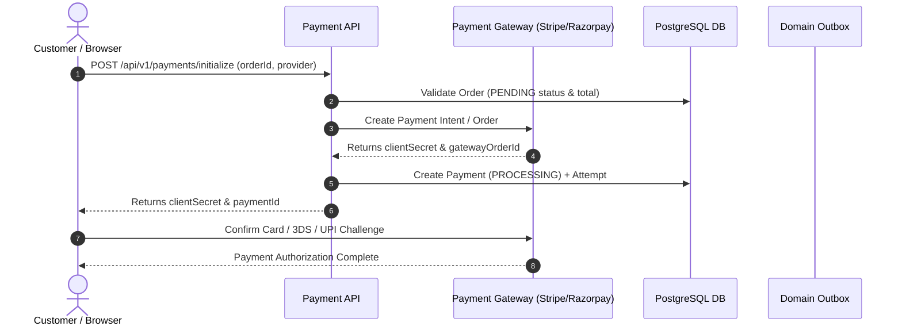
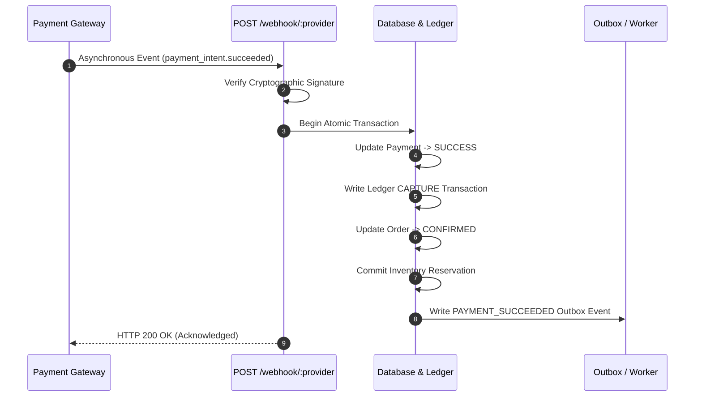
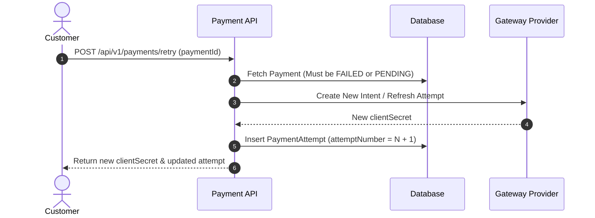

# Payments Module API & Integration Documentation

> **Base Route**: `/api/v1/payments`  
> **Route Definition**: [`src/modules/payments/routes/payment.route.ts`](file:///e:/e-com/server/src/modules/payments/routes/payment.route.ts)  
> **Controllers**: [`src/modules/payments/controller/payment.controller.ts`](file:///e:/e-com/server/src/modules/payments/controller/payment.controller.ts), [`src/modules/payments/controller/paymentWebhook.controller.ts`](file:///e:/e-com/server/src/modules/payments/controller/paymentWebhook.controller.ts)  
> **Services**: [`src/modules/payments/services/payment.service.ts`](file:///e:/e-com/server/src/modules/payments/services/payment.service.ts)  
> **Validation Schemas**: [`src/modules/payments/validations/payment.validation.ts`](file:///e:/e-com/server/src/modules/payments/validations/payment.validation.ts)  
> **Admin Guide**: [`ADMIN_PAYMENTS.README.md`](file:///e:/e-com/server/src/modules/payments/ADMIN_PAYMENTS.README.md)

---

## Table of Contents

1. [Architecture & Design Principles](#architecture--design-principles)
2. [Supported Payment Gateways](#supported-payment-gateways)
3. [Lifecycle & State Machine](#lifecycle--state-machine)
4. [Endpoints Summary](#endpoints-summary)
5. [Endpoint Specifications & Scenarios](#endpoint-specifications--scenarios)
   - [1. Initialize Payment Intent (`POST /initialize`)](#1-initialize-payment-intent-post-initialize)
   - [2. Retry Failed Payment (`POST /retry`)](#2-retry-failed-payment-post-retry)
   - [3. Ingest Gateway Webhook (`POST /webhook/:provider`)](#3-ingest-gateway-webhook-post-webhookprovider)
   - [4. Get Payment Details & Attempt Ledger (`GET /:id`)](#4-get-payment-details--attempt-ledger-get-id)
   - [5. Process Refund (`POST /refund`)](#5-process-refund-post-refund)
   - [6. Reconcile Payment (`POST /reconcile`)](#6-reconcile-payment-post-reconcile)
   - [7. List Payments (`GET /admin/list`)](#7-list-payments-get-adminlist)
6. [Flow Diagrams](#flow-diagrams)
   - [Customer Checkout & Payment Intent Flow](#customer-checkout--payment-intent-flow)
   - [Webhook Ingestion & Order Confirmation](#webhook-ingestion--order-confirmation)
   - [Payment Retry Workflow](#payment-retry-workflow)
7. [Frontend Client SDK Integration](#frontend-client-sdk-integration)
8. [Error Handling & Status Codes](#error-handling--status-codes)

---

## Architecture & Design Principles

The Payments module handles financial transactions across multiple payment gateways (Stripe, Razorpay, Mock simulator) with the following core architectural guarantees:

- **Gateway Agnostic Abstraction**: Abstract `IPaymentProvider` interface standardizes intent creation, signature verification, capture, refund, and reconciliation.
- **Idempotency & Deduplication**: All webhook handlers, retry calls, and refund requests are strictly idempotent to prevent duplicate charges or over-refunding.
- **Double-Entry Ledger & Discrete Attempts**: Every payment tracks individual gateway attempts (`PaymentAttempt`) and immutable financial ledger records (`PaymentTransaction`) with signed amounts.
- **Transactional Consistency**: Payment transitions atomically trigger order confirmations (`Order.status -> CONFIRMED`), convert inventory holds to committed stock, and emit domain events through the transactional outbox pattern.
- **Self-Healing Reconciliation**: Active polling and reconciliation capabilities allow healing payments stuck in `PROCESSING` if webhooks are delayed or lost.

---

## Supported Payment Gateways

| Gateway | Identifier | Supported Methods | Features |
|---|---|---|---|
| **Stripe** | `STRIPE` | Credit/Debit Cards, Apple Pay, Google Pay | PaymentIntents API, 3D Secure, Cryptographic Webhook verification, Partial & Full Refunds |
| **Razorpay** | `RAZORPAY` | UPI, Netbanking, Credit/Debit Cards, Wallets | Order creation, HMAC-SHA256 signature verification, Instant Refunds |
| **Mock Gateway** | `MOCK` | Simulated Gateway | Deterministic test harnesses for CI/CD and local development |

---

## Lifecycle & State Machine

```
              ┌────────────────────────┐
              │        PENDING         │
              └───────────┬────────────┘
                          │
                  POST /initialize
                          │
              ┌───────────▼────────────┐
              │       PROCESSING       │
              └───────────┬────────────┘
                          │
          ┌───────────────┴───────────────┐
          │                               │
    Webhook: SUCCESS                Webhook: FAILED
          │                               │
          ▼                               ▼
  ┌───────────────┐               ┌───────────────┐
  │    SUCCESS    │               │    FAILED     │◀─── POST /retry
  └───────┬───────┘               └───────────────┘
          │
  POST /refund (Partial/Full)
          │
          ▼
  ┌───────────────┐
  │   REFUNDED /  │
  │ PARTIALLY_REF │
  └───────────────┘
```

---

## Endpoints Summary

| Method | Endpoint | Auth / Permission | Description |
|---|---|---|---|
| `POST` | `/api/v1/payments/initialize` | Public / User (`optionalAuthenticate`) | Create payment intent/session for a pending order |
| `POST` | `/api/v1/payments/retry` | Public / User (`optionalAuthenticate`) | Create new attempt for a pending or failed payment |
| `POST` | `/api/v1/payments/webhook/:provider` | Public (Gateway Signature Checked) | Ingest asynchronous gateway event |
| `GET` | `/api/v1/payments/:id` | Public / User / Admin | Fetch payment record, attempts, ledger transactions |
| `POST` | `/api/v1/payments/refund` | Admin (`payment:refund`) | Execute full or partial refund with gateway dispatch |
| `POST` | `/api/v1/payments/reconcile` | Admin (`payment:read`) | Reconcile payment state directly with gateway API |
| `GET` | `/api/v1/payments/admin/list` | Admin (`payment:read`) | Query and paginate all platform payments |

---

## Endpoint Specifications & Scenarios

---

### 1. Initialize Payment Intent (`POST /initialize`)

Initializes a payment intent with the requested gateway provider for an existing order in `PENDING` status.

- **Method**: `POST`
- **URL**: `/api/v1/payments/initialize`
- **Authentication**: Optional Bearer Token (Associates userId if authenticated)

#### Request Body Schema
| Field | Type | Required | Default | Description |
|---|---|---|---|---|
| `orderId` | `UUID` | Yes | - | Valid order UUID in `PENDING` status |
| `provider` | `enum` | No | `"MOCK"` | Gateway provider: `"MOCK"`, `"STRIPE"`, `"RAZORPAY"` |
| `paymentMethod` | `string` | No | - | Payment method identifier (e.g. `card_visa`, `upi`) |
| `returnUrl` | `URL` | No | - | Client redirect URL upon 3DS / hosted checkout completion |
| `metadata` | `object` | No | - | Arbitrary key-value metadata |

#### Request Body Example
```json
{
  "orderId": "65b8f2c1-8e9a-4c22-b514-61c0c1b7e199",
  "provider": "STRIPE",
  "returnUrl": "https://store.example.com/checkout/success"
}
```

#### Scenarios

##### Scenario 1.A: Success - Stripe Payment Intent Created (`201 Created` / `200 OK`)
```json
{
  "success": true,
  "message": "Payment intent initialized successfully",
  "data": {
    "paymentId": "73c1a2d4-e5f6-4a1b-9c8d-123456789abc",
    "orderId": "65b8f2c1-8e9a-4c22-b514-61c0c1b7e199",
    "amount": 126.64,
    "currency": "USD",
    "status": "PROCESSING",
    "provider": "STRIPE",
    "clientSecret": "pi_3MtwBwLkdIwHu7ix28a3tqPa_secret_Yr6kL9...",
    "gatewayOrderId": "pi_3MtwBwLkdIwHu7ix28a3tqPa",
    "attemptNumber": 1
  }
}
```

##### Scenario 1.B: Error - Order Already Paid or Cancelled (`400 Bad Request`)
```json
{
  "success": false,
  "message": "Cannot initialize payment for order with status \"CONFIRMED\"",
  "statusCode": 400
}
```

##### Scenario 1.C: Error - Order Not Found (`404 Not Found`)
```json
{
  "success": false,
  "message": "Order not found",
  "statusCode": 404
}
```

---

### 2. Retry Failed Payment (`POST /retry`)

Creates a new payment attempt for an existing payment record whose previous attempt failed or expired.

- **Method**: `POST`
- **URL**: `/api/v1/payments/retry`
- **Authentication**: Optional Bearer Token

#### Request Body Schema
| Field | Type | Required | Description |
|---|---|---|---|
| `paymentId` | `UUID` | Yes | Existing payment UUID |
| `paymentMethod` | `string` | No | Alternative payment method |
| `metadata` | `object` | No | Additional tracking metadata |

#### Request Body Example
```json
{
  "paymentId": "73c1a2d4-e5f6-4a1b-9c8d-123456789abc",
  "paymentMethod": "card_mastercard"
}
```

#### Scenarios

##### Scenario 2.A: Success - Retry Attempt Created (`200 OK`)
```json
{
  "success": true,
  "message": "Payment retry initialized successfully",
  "data": {
    "paymentId": "73c1a2d4-e5f6-4a1b-9c8d-123456789abc",
    "status": "PROCESSING",
    "attemptNumber": 2,
    "clientSecret": "pi_3MtwBwLkdIwHu7ix28a3tqPa_secret_ReTry2...",
    "gatewayOrderId": "pi_3MtwBwLkdIwHu7ix28a3tqPa"
  }
}
```

##### Scenario 2.B: Error - Payment Already Succeeded (`400 Bad Request`)
```json
{
  "success": false,
  "message": "Cannot retry payment that has already succeeded",
  "statusCode": 400
}
```

---

### 3. Ingest Gateway Webhook (`POST /webhook/:provider`)

Asynchronous endpoint invoked by payment gateways (Stripe, Razorpay, Mock). Verifies payload cryptographic HMAC signatures, updates payment status, confirms orders, commits inventory holds, and records outbox events.

- **Method**: `POST`
- **URL**: `/api/v1/payments/webhook/:provider` (`mock`, `stripe`, `razorpay`)
- **Authentication**: Gateway cryptographic signature in HTTP headers (`stripe-signature`, `x-razorpay-signature`)

#### Headers
- **Stripe**: `stripe-signature: t=1614000000,v1=5257a869e7eceefe25949b39...`
- **Razorpay**: `x-razorpay-signature: 4a64d5...`

#### Scenarios

##### Scenario 3.A: Success - Payment Succeeded Event (`200 OK`)
```json
{
  "received": true,
  "status": "SUCCESS",
  "paymentId": "73c1a2d4-e5f6-4a1b-9c8d-123456789abc",
  "orderId": "65b8f2c1-8e9a-4c22-b514-61c0c1b7e199"
}
```

##### Scenario 3.B: Error - Invalid Webhook Signature (`400 Bad Request`)
```json
{
  "success": false,
  "message": "Webhook signature verification failed for provider STRIPE",
  "statusCode": 400
}
```

---

### 4. Get Payment Details & Attempt Ledger (`GET /:id`)

Fetches payment breakdown including discrete attempts, ledger transactions, and refund records.

- **Method**: `GET`
- **URL**: `/api/v1/payments/:id`
- **Authentication**: Optional Bearer Token / Admin permission

#### Scenarios

##### Scenario 4.A: Success (`200 OK`)
```json
{
  "success": true,
  "message": "Payment retrieved successfully",
  "data": {
    "id": "73c1a2d4-e5f6-4a1b-9c8d-123456789abc",
    "orderId": "65b8f2c1-8e9a-4c22-b514-61c0c1b7e199",
    "status": "SUCCESS",
    "amount": 126.64,
    "refundedAmount": 0.00,
    "currency": "USD",
    "provider": "STRIPE",
    "attempts": [
      {
        "id": "att-1",
        "attemptNumber": 1,
        "status": "SUCCESS",
        "gatewayTransactionId": "pi_3MtwBwLkdIwHu7ix28a3tqPa",
        "gatewayResponseCode": "200",
        "createdAt": "2026-09-08T12:00:05.000Z"
      }
    ],
    "transactions": [
      {
        "id": "txn-1",
        "type": "CAPTURE",
        "amount": 126.64,
        "currency": "USD",
        "gatewayTransactionId": "ch_3MtwBwLkdIwHu7ix28a3tqPa",
        "createdAt": "2026-09-08T12:02:00.000Z"
      }
    ],
    "refunds": []
  }
}
```

---

### 5. Process Refund (`POST /refund`)

Issues a full or partial refund against a succeeded payment.

- **Method**: `POST`
- **URL**: `/api/v1/payments/refund`
- **Permission**: `payment:refund` or `SUPER_ADMIN`

#### Request Body
```json
{
  "paymentId": "73c1a2d4-e5f6-4a1b-9c8d-123456789abc",
  "amount": 50.00,
  "reason": "Customer returned 1 item"
}
```

#### Scenarios

##### Scenario 5.A: Success - Partial Refund (`200 OK`)
```json
{
  "success": true,
  "message": "Refund processed successfully",
  "data": {
    "refundId": "ref-11111111-2222-3333-4444-555555555555",
    "paymentId": "73c1a2d4-e5f6-4a1b-9c8d-123456789abc",
    "amount": 50.00,
    "currency": "USD",
    "status": "COMPLETED",
    "remainingRefundable": 76.64,
    "paymentStatus": "PARTIALLY_REFUNDED"
  }
}
```

---

### 6. Reconcile Payment (`POST /reconcile`)

Queries the gateway provider to synchronize payment state and heal missed webhooks.

- **Method**: `POST`
- **URL**: `/api/v1/payments/reconcile`
- **Permission**: `payment:read` or `SUPER_ADMIN`

#### Request Body
```json
{
  "paymentId": "73c1a2d4-e5f6-4a1b-9c8d-123456789abc"
}
```

#### Response (`200 OK`)
```json
{
  "success": true,
  "message": "Payment reconciled successfully with provider",
  "data": {
    "paymentId": "73c1a2d4-e5f6-4a1b-9c8d-123456789abc",
    "previousStatus": "PROCESSING",
    "currentStatus": "SUCCESS",
    "reconciled": true,
    "orderUpdated": true
  }
}
```

---

### 7. List Payments (`GET /admin/list`)

Lists all platform payments with pagination, status, and provider filters.

- **Method**: `GET`
- **URL**: `/api/v1/payments/admin/list?page=1&limit=20&status=SUCCESS`
- **Permission**: `payment:read` or `SUPER_ADMIN`

---

## Flow Diagrams

### Customer Checkout & Payment Intent Flow



### Webhook Ingestion & Order Confirmation



### Payment Retry Workflow



---

## Frontend Client SDK Integration

### Stripe Elements (Web / React)

```typescript
import { loadStripe } from "@stripe/stripe-js";
import { Elements, PaymentElement, useStripe, useElements } from "@stripe/react-stripe-js";

// 1. Initialize intent on backend
const response = await fetch("/api/v1/payments/initialize", {
  method: "POST",
  headers: { "Content-Type": "application/json" },
  body: JSON.stringify({
    orderId: "65b8f2c1-8e9a-4c22-b514-61c0c1b7e199",
    provider: "STRIPE",
    returnUrl: `${window.location.origin}/checkout/complete`,
  }),
});
const { data } = await response.json();
const { clientSecret } = data;

// 2. Render Stripe PaymentElement with clientSecret
// 3. Confirm payment with stripe.confirmPayment({ elements, confirmParams: { return_url: "..." } })
```

---

## Error Handling & Status Codes

| HTTP Status | Error Type | Cause / Recommended Action |
|---|---|---|
| `400 Bad Request` | `VALIDATION_ERROR` | Malformed UUID, negative amount, or invalid gateway payload |
| `400 Bad Request` | `INVALID_PAYMENT_STATE` | Attempting to retry a succeeded payment or refund a failed payment |
| `400 Bad Request` | `OVER_REFUND_ERROR` | Requested refund amount exceeds remaining refundable balance |
| `400 Bad Request` | `SIGNATURE_VERIFICATION_FAILED` | Gateway webhook signature mismatch |
| `401 Unauthorized` | `AUTHENTICATION_REQUIRED` | Missing or expired JWT Bearer token |
| `403 Forbidden` | `PERMISSION_DENIED` | Missing `payment:read` or `payment:refund` permission |
| `404 Not Found` | `PAYMENT_NOT_FOUND` | Referenced payment ID does not exist |
| `500 Internal Server Error`| `GATEWAY_ERROR` | Upstream provider connection failure or server error |
