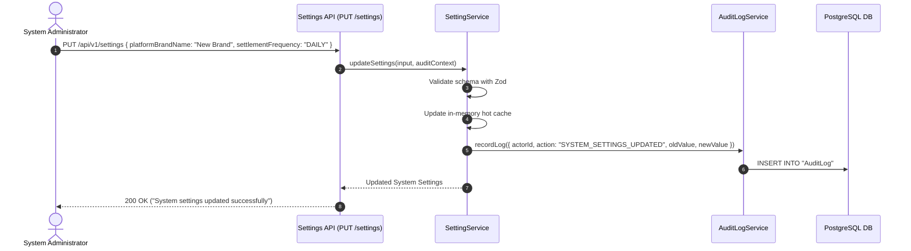
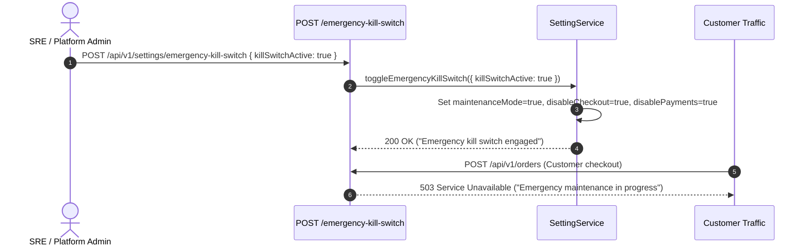

# Platform System Settings & Governance Module Documentation

> **Base Route**: `/api/v1/settings`  
> **Route Definition**: [`src/modules/settings/routes/setting.route.ts`](file:///e:/e-com/server/src/modules/settings/routes/setting.route.ts)  
> **Controller**: [`src/modules/settings/controller/setting.controller.ts`](file:///e:/e-com/server/src/modules/settings/controller/setting.controller.ts)  
> **Service**: [`src/modules/settings/services/setting.service.ts`](file:///e:/e-com/server/src/modules/settings/services/setting.service.ts)  
> **Validation Schemas**: [`src/modules/settings/validations/setting.validation.ts`](file:///e:/e-com/server/src/modules/settings/validations/setting.validation.ts)  
> **Admin Operations Guide**: [`ADMIN_SETTINGS.README.md`](file:///e:/e-com/server/src/modules/settings/ADMIN_SETTINGS.README.md)

---

## Table of Contents

1. [Architecture & Design Principles](#architecture--design-principles)
2. [3-Tier Platform Settings Breakdown](#3-tier-platform-settings-breakdown)
3. [Developer Integration: Feature Flags & Canary Rollouts](#developer-integration-feature-flags--canary-rollouts)
4. [Endpoints Summary](#endpoints-summary)
5. [Customer / Public Endpoints](#customer--public-endpoints)
   - [1. Get Public Storefront Settings (`GET /public`)](#1-get-public-storefront-settings-get-public)
6. [Administrative Endpoints](#administrative-endpoints)
   - [2. Get Full System Settings (`GET /`)](#2-get-full-system-settings-get-)
   - [3. Update System Settings (`PUT /`)](#3-update-system-settings-put-)
   - [4. Toggle Emergency Kill Switch (`POST /emergency-kill-switch`)](#4-toggle-emergency-kill-switch-post-emergency-kill-switch)
7. [Sequence Diagrams](#sequence-diagrams)
   - [Settings Update & Audit Trail Lifecycle](#settings-update--audit-trail-lifecycle)
   - [Emergency Kill Switch Execution Loop](#emergency-kill-switch-execution-loop)
8. [Frontend React / Next.js Admin Settings Component](#frontend-react--nextjs-admin-settings-component)
9. [Error Codes & Diagnostics](#error-codes--diagnostics)

---

## Architecture & Design Principles

The **Settings** module provides high-speed in-memory configuration caching, dynamic runtime feature toggles, financial settlement policies, and emergency protective kill switches.

### Architectural Highlights

- **Sub-Millisecond Read Performance**: Reads are served directly from an in-memory cache synchronized across workers.
- **Strict Zod Validation**: Every update payload is validated against strict boundaries before committing to memory and the audit log.
- **Canary Percentage Rollout**: Supports consistent user bucket hashing for gradual 0–100% feature rollouts.
- **Audit Log Emission**: All administrative updates write immutable audit records to `AuditLog`.

---

## 3-Tier Platform Settings Breakdown

### Tier 1 — Core Platform, Brand & Communication
- `platformBrandName`: e.g. `"Nexus Commerce"`
- `publicDomainUrl`: e.g. `"https://store.example.com"`
- `supportEmail`, `operationsEmail`, `securityEmail`
- `defaultCurrency`: e.g. `"USD"`, `"EUR"`, `"INR"`
- `timezone`: e.g. `"UTC"`, `"America/New_York"`
- `requireAdmin2FA`: boolean

### Operational Modes & Rate Limits
- `maintenanceMode`: boolean (Blocks public traffic with 503)
- `readOnlyMode`: boolean (Disables state mutations with 423)
- `disableCheckout`: boolean
- `disablePayments`: boolean
- `globalApiRateLimit`, `loginRateLimit`, `checkoutRateLimit`

### Tier 2 — Financial Rules & Settlement Policies
- `settlementFrequency`: `"DAILY"`, `"WEEKLY"`, `"BI_WEEKLY"`, `"MONTHLY"`
- `settlementDelayDays`: Holding buffer in days (e.g. 2 for T+2)
- `minimumPayoutAmount`: e.g. $50.00
- `reservePercentage`: e.g. 5.0% rolling reserve
- `refundApprovalThreshold`: e.g. $500.00
- `automatedPayouts`: boolean

### Tier 3 — Advanced, Security & Emergency Controls
- `allowedMaintenanceIps`: string[] (Whitelisted IPs allowed during maintenance)
- `emergencyControls`: `{ killSwitchActive, emergencyMessage, frozenAt }`
- `dataRetentionDays`: integer (e.g. 365 days)

---

## Developer Integration: Feature Flags & Canary Rollouts

You can check feature flag enablement in any backend service using `settingService.isFeatureEnabled()`:

```typescript
import { settingService } from "@/modules/settings/services/setting.service.js";

// 1. Simple boolean check
if (settingService.isFeatureEnabled("enableAiSearch")) {
  // Execute AI search pipeline
}

// 2. User-specific canary rollout (deterministic hash)
const isCanaryUser = settingService.isFeatureEnabled("newCheckoutFunnel", userId);
if (isCanaryUser) {
  // Serve v2 checkout experience
}
```

---

## Endpoints Summary

| Method | Endpoint | Required Permission | Description |
|---|---|---|---|
| `GET` | `/api/v1/settings/public` | Public / Storefront | Brand name, public URL, currency, timezone, and public feature flags |
| `GET` | `/api/v1/settings` | `system:manage` | Retrieve full system configuration across all 3 tiers |
| `PUT` | `/api/v1/settings` | `system:manage` | Update system settings with schema validation and audit logging |
| `POST` | `/api/v1/settings/emergency-kill-switch` | `system:manage` | Immediately freeze or restore platform operations |

---

## Customer / Public Endpoints

---

### 1. Get Public Storefront Settings (`GET /public`)

- **Method**: `GET`
- **URL**: `/api/v1/settings/public`
- **Authentication**: None (Public)

#### Response (`200 OK`)
```json
{
  "success": true,
  "status": "success",
  "data": {
    "platformBrandName": "Nexus Global Commerce",
    "publicDomainUrl": "https://store.example.com",
    "supportEmail": "support@example.com",
    "defaultCurrency": "USD",
    "timezone": "UTC",
    "maintenanceMode": false,
    "readOnlyMode": false,
    "disableCheckout": false,
    "disablePayments": false,
    "featureFlags": {
      "enableReviews": true,
      "enableCoupons": true,
      "enableWishlists": true,
      "enableGuestCheckout": true,
      "enableExpressPay": true,
      "enableAiSearch": false
    }
  }
}
```

---

## Administrative Endpoints

*(For detailed schemas, field constraints, and SRE runbooks, refer to [`ADMIN_SETTINGS.README.md`](file:///e:/e-com/server/src/modules/settings/ADMIN_SETTINGS.README.md))*

### 2. Get Full System Settings (`GET /`)
- **Permission**: `system:manage`
- **URL**: `/api/v1/settings`

### 3. Update System Settings (`PUT /`)
- **Permission**: `system:manage`
- **URL**: `/api/v1/settings`

### 4. Toggle Emergency Kill Switch (`POST /emergency-kill-switch`)
- **Permission**: `system:manage`
- **URL**: `/api/v1/settings/emergency-kill-switch`

---

## Sequence Diagrams

### Settings Update & Audit Trail Lifecycle



### Emergency Kill Switch Execution Loop



---

## Frontend React / Next.js Admin Settings Component

```tsx
import { useState, useEffect } from "react";

export function SystemSettingsDashboard() {
  const [settings, setSettings] = useState<any>(null);
  const [saving, setSaving] = useState(false);

  useEffect(() => {
    fetch("/api/v1/settings", { headers: { Authorization: `Bearer ${token}` } })
      .then((res) => res.json())
      .then((data) => setSettings(data.data));
  }, []);

  const handleSave = async () => {
    setSaving(true);
    await fetch("/api/v1/settings", {
      method: "PUT",
      headers: { "Content-Type": "application/json", Authorization: `Bearer ${token}` },
      body: JSON.stringify(settings),
    });
    setSaving(false);
    alert("Settings updated successfully!");
  };

  const handleKillSwitch = async (activate: boolean) => {
    if (!confirm(`Are you sure you want to ${activate ? "ACTIVATE" : "DEACTIVATE"} the Emergency Kill Switch?`)) return;
    await fetch("/api/v1/settings/emergency-kill-switch", {
      method: "POST",
      headers: { "Content-Type": "application/json", Authorization: `Bearer ${token}` },
      body: JSON.stringify({ killSwitchActive: activate }),
    });
    window.location.reload();
  };

  if (!settings) return <div>Loading System Settings...</div>;

  return (
    <div className="settings-page">
      <h2>Platform Governance & System Settings</h2>

      {/* Emergency Kill Switch Banner */}
      <div className={`alert ${settings.emergencyControls?.killSwitchActive ? "alert-danger" : "alert-info"}`}>
        <h3>Emergency Kill Switch: {settings.emergencyControls?.killSwitchActive ? "ENGAGED" : "OFF"}</h3>
        <button onClick={() => handleKillSwitch(!settings.emergencyControls?.killSwitchActive)}>
          {settings.emergencyControls?.killSwitchActive ? "Disengage Kill Switch" : "Engage Emergency Kill Switch"}
        </button>
      </div>

      {/* Tier 1: Brand */}
      <section>
        <h3>Tier 1: Core Brand & Communication</h3>
        <label>Platform Brand Name</label>
        <input
          value={settings.platformBrandName}
          onChange={(e) => setSettings({ ...settings, platformBrandName: e.target.value })}
        />
        <label>Support Email</label>
        <input
          value={settings.supportEmail}
          onChange={(e) => setSettings({ ...settings, supportEmail: e.target.value })}
        />
      </section>

      {/* Tier 2: Financial Rules */}
      <section>
        <h3>Tier 2: Financial Rules & Settlement</h3>
        <label>Settlement Frequency</label>
        <select
          value={settings.settlementFrequency}
          onChange={(e) => setSettings({ ...settings, settlementFrequency: e.target.value })}
        >
          <option value="DAILY">Daily</option>
          <option value="WEEKLY">Weekly</option>
          <option value="MONTHLY">Monthly</option>
        </select>
        <label>Refund Approval Threshold ($)</label>
        <input
          type="number"
          value={settings.refundApprovalThreshold}
          onChange={(e) => setSettings({ ...settings, refundApprovalThreshold: Number(e.target.value) })}
        />
      </section>

      <button onClick={handleSave} disabled={saving}>Save Changes</button>
    </div>
  );
}
```

---

## Error Codes & Diagnostics

| HTTP Status | Error Type | Solution |
|---|---|---|
| `400 Bad Request` | `VALIDATION_ERROR` | Ensure rate limits and threshold numbers are non-negative |
| `401 Unauthorized` | `UNAUTHENTICATED` | Provide Bearer token |
| `403 Forbidden` | `FORBIDDEN` | Requires `system:manage` permission or `SUPER_ADMIN` role |
| `503 Unavailable` | `MAINTENANCE_MODE` | Platform is in maintenance mode; whitelisted IPs only |
